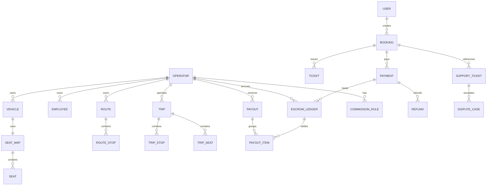

# 04. Database Design - Hệ thống đặt vé xe khách

## 1. Thông tin tài liệu

### 1.1. Metadata

| Thuộc tính    | Giá trị                     |
| ------------- | --------------------------- |
| Tên tài liệu  | Database Design             |
| Mã tài liệu   | 04-database-design          |
| Dự án         | Marketplace-Ve-Xe-Nhanh     |
| Trạng thái    | Approved                    |
| Người viết    | Nguyễn Hồng Khanh, AI Agent |
| Người duyệt   | Nguyễn Hồng Khanh           |
| Ngày tạo      | 11/05/2026                  |
| Ngày cập nhật | 22/09/2026                  |

### 1.2. Lịch sử thay đổi

| Phiên bản | Ngày       | Người cập nhật | Nội dung thay đổi                                                                                                                                                                                                                                                                                                                                                                                                                                                                                                                                                                                                                                        |
| --------- | ---------- | -------------- | -------------------------------------------------------------------------------------------------------------------------------------------------------------------------------------------------------------------------------------------------------------------------------------------------------------------------------------------------------------------------------------------------------------------------------------------------------------------------------------------------------------------------------------------------------------------------------------------------------------------------------------------------------- |
| v0.1      | 11/05/2026 | AI Agent       | Tạo bản nháp Database Design từ SRS/HLD                                                                                                                                                                                                                                                                                                                                                                                                                                                                                                                                                                                                                  |
| v0.2      | 25/05/2026 | AI Agent       | Align owner module theo `context/DOMAIN-MAP`; đóng DB-OQ-02 (fare snapshot) và DB-OQ-04 (audit MongoDB); chốt SeatHold TTL 10 phút                                                                                                                                                                                                                                                                                                                                                                                                                                                                                                                       |
| v0.3      | 25/05/2026 | AI Agent       | Cập nhật tham chiếu SRS v1.15 → v1.20; cập nhật số mục DOMAIN-MAP sau khi §5 "Refactor radar" được xóa. Không thay đổi nội dung normative.                                                                                                                                                                                                                                                                                                                                                                                                                                                                                                               |
| v0.7      | 19/09/2026 | AI Agent       | **TASK-IAM-004 (MFA TOTP)**: thêm `mfa_credentials` (secret TOTP chỉ lưu AES-256-GCM, `last_totp_counter` chống replay, unique `(subject_type, subject_id)`, CHECK không cho `PASSENGER`) + `mfa_backup_codes` (chỉ hash SHA-256, `used_at` single-use, unique `(credential_id, code_hash)`) — cả hai **RLS chỉ cho ngữ cảnh `system`** (xoá được credential = login sau quay về enrollment chỉ bằng mật khẩu); thêm `auth_sessions.mfa_verified_at` và giá trị `MFA_REQUIRED` cho `SessionRevokeReason`. §5 + §7. |
| v0.8      | 22/09/2026 | AI Agent       | **TASK-IAM-005 Q3/Q4/Q6/Q8:** `operator_accounts` và `employee_accounts` thêm contact email, cờ đổi mật khẩu lần đầu, hạn mật khẩu tạm và `auth_epoch`; legacy không bị force-change. `auth_sessions.auth_epoch` chụp phiên bản lúc phát, guard so lại trên mỗi request nội bộ để chặn session cũ khi Redis post-revoke lỗi. `operator_login_names` khóa unique `(operator_id, username)` xuyên Owner/Employee, trigger giữ registry và RLS `ENABLE+FORCE`; `operatorSlug` immutable và Owner có compound FK `(operator_id, operator_slug)`. Migration kiểm collision/backfill trước khi thêm constraint. |
| v0.6      | 18/09/2026 | AI Agent       | **DB-PRIN-01** khớp hiện thực TASK-IAM-003: policy so **text** (id tenant là uuid chuỗi, bản cũ ghi `::bigint` sai kiểu), hàm `app_rls_allows()` đọc GUC `app.scope` (`tenant`/`platform`/`system`, không set → 0 row); app chạy bằng role riêng không superuser/BYPASSRLS, migrate/seed bằng owner qua `MIGRATION_DATABASE_URL`. RLS bật trên `operator_accounts`, `employee_accounts` (tenant đọc/ghi), `auth_sessions` (tenant chỉ đọc, `system` ghi), `operator_profiles` (ai cũng đọc, platform/system ghi); FK account → `operator_profiles` đổi sang RESTRICT. |
| v0.5      | 16/09/2026 | AI Agent       | **§7**: bổ sung index cho `auth_sessions` khi hiện thực TASK-IAM-002 — thêm **index `family_id` đứng riêng** (revoke-family tra theo `family_id` một mình; index composite `(user_ref, family_id)` có `user_ref` đứng đầu nên không phục vụ được, thiếu nó là seq-scan cả bảng đúng lúc phát hiện reuse) và index `operator_id` (chuẩn bị RLS ở IAM-003 + revoke hàng loạt khi Operator bị suspend). Không đổi nội dung normative nào khác. |
| v0.4      | 01/06/2026 | AI Agent       | **Sprint 5 Rework** — reset paradigm theo **ADR-011 Hybrid-A**: operational = PostgreSQL 16 + Prisma 5 (bảng quan hệ); audit = MongoDB 7 + Mongoose cluster RIÊNG (chỉ `audit_event` + `system_log`). Money = `BIGINT` VND; multi-tenant = guard + Postgres RLS; field linh hoạt = `JSONB`. **Đóng DB-OQ-01** (SeatHold = Redis thuần `SET NX EX 600` per ADR-015, bỏ bảng seat_holds v1) + **DB-OQ-04** (Mongo cluster RIÊNG per ADR-011) + **DB-OQ-05** (storage R2 per ADR-018; KYC production location → OQ-21). Refine DB-OQ-03 (escrow accounting model). Reframe §4 nguyên tắc, §5 bảng/collection, §7 index, §8 transaction/lock, §10 migration. |

---

## 2. Mục lục

1. Thông tin tài liệu
2. Mục lục
3. Giới thiệu
4. Nguyên tắc dữ liệu
5. Mô hình lưu trữ Hybrid-A
6. Quan hệ dữ liệu mức cao
7. Index và constraint
8. Transaction, lock và idempotency
9. Retention, archive và soft delete
10. Migration strategy
11. Open Questions / TBD

---

## 3. Giới thiệu

Tài liệu này mô tả thiết kế dữ liệu mức database cho hệ thống. Theo **ADR-011** (Layer 4, chốt 25/05/2026), v1 dùng kiến trúc **Hybrid-A**: toàn bộ dữ liệu operational nằm ở **PostgreSQL 16** (truy cập qua **Prisma 5**); riêng audit/log nằm ở **MongoDB 7** trên một **cluster RIÊNG** (truy cập qua **Mongoose 8**). Bản nháp này định hướng bảng/collection, ownership, index, constraint, lock và transaction boundary; chi tiết field hoàn thiện ở LLD.

### 3.1. Tài liệu tham chiếu

| Tài liệu                             | Vai trò                                                                                                                                                             |
| ------------------------------------ | ------------------------------------------------------------------------------------------------------------------------------------------------------------------- |
| `01-srs-he-thong-dat-ve-xe-khach.md` | Entity groups §9.2, state enum §17, FR/BR ràng buộc dữ liệu                                                                                                         |
| `02-hld-he-thong-dat-ve-xe-khach.md` | Data ownership mức cao §9, tích hợp ngoài §13                                                                                                                       |
| `10-architecture-decision-record.md` | **ADR-011** (Hybrid-A DB), **ADR-015** (Redis seat hold), **ADR-017** (identity + RLS), **ADR-018** (R2 storage), **ADR-019** (payment dedup), **ADR-022** (payout) |
| `03-lld-he-thong-dat-ve-xe-khach.md` | Service ↔ table/collection ownership (rework Sprint 5)                                                                                                              |
| `context/DOMAIN-MAP.md`              | Entity groups §2, state enum §5, tenant boundary §6                                                                                                                 |
| `context/GLOSSARY.md`                | Đặt tên entity, attribute, state                                                                                                                                    |
| `context/PROJECT-STATE.md`           | OQ đã đóng ràng buộc thiết kế (seat hold 10min, fare snapshot, escrow T+3, commission 5%) + OQ-21 KYC storage production                                            |

---

## 4. Nguyên tắc dữ liệu

| ID         | Nguyên tắc                                                                                                                                                                                                                                                                                                                                                                                                                                            |
| ---------- | ----------------------------------------------------------------------------------------------------------------------------------------------------------------------------------------------------------------------------------------------------------------------------------------------------------------------------------------------------------------------------------------------------------------------------------------------------- |
| DB-PRIN-01 | Dữ liệu theo Operator phải có cột `operator_id`; lọc tenant qua app guard **và** Postgres RLS. Mỗi tenant table: `ENABLE` + **`FORCE ROW LEVEL SECURITY`** + policy `USING (app_rls_allows(operator_id)) WITH CHECK (app_rls_allows(operator_id))` — hàm đọc GUC `app.scope` (`tenant` → `operator_id = current_setting('app.operator_id', true)`, so **text** vì id là uuid chuỗi; `platform`/`system` → toàn bộ; không set → **false**, fail-closed). App set GUC bằng `set_config(..., true)` (transaction-local) qua `PrismaService.withScope` với `DbScope` có brand do `TenantGuard` trao; `withTenant/withPlatform/withSystem` chỉ cho `iam/auth`, `iam/session`, `iam/role`, `database` (ESLint `system-db-context`). RLS là **lớp chặn cuối** (policy không dùng được index) — service vẫn lọc `operator_id` tường minh. Production từ chối khởi động nếu role vượt được RLS hoặc bảng tenant chưa FORCE RLS. FK tới bảng tenant dùng **RESTRICT** (cascade chạy với quyền owner, vượt RLS). **App DB role KHÔNG được owner/superuser/BYPASSRLS** (nếu không RLS bị bypass): app chạy bằng role riêng (`DATABASE_URL`, script `db:app-role`), migrate/seed bằng owner (`MIGRATION_DATABASE_URL`) — defense-in-depth (ADR-011, ADR-017). _Cập nhật 18/09/2026, TASK-IAM-003._ |
| DB-PRIN-02 | Booking, Ticket, Payment, Refund, EscrowLedger và Payout phải truy vết hai chiều (state history + reconciliation).                                                                                                                                                                                                                                                                                                                                    |
| DB-PRIN-03 | Booking và Ticket phải lưu snapshot dữ liệu (fare, policy, promotion) tại thời điểm mua; snapshot không bị ghi đè khi nguồn đổi.                                                                                                                                                                                                                                                                                                                      |
| DB-PRIN-04 | Không xóa cứng dữ liệu giao dịch trong production (soft delete/archive). Audit lưu Mongo cluster RIÊNG, **append-only** qua REVOKE UPDATE/DELETE cho app DB user (ADR-011).                                                                                                                                                                                                                                                                           |
| DB-PRIN-05 | Index phải phục vụ query chính: search trip, tenant query, booking lookup, payment reconciliation, reporting.                                                                                                                                                                                                                                                                                                                                         |
| DB-PRIN-06 | Mọi cột tiền = VND kiểu **`BIGINT`** (đơn vị đồng, integer-only); tính % (commission) trong app bằng `Decimal.js`. **Cấm** `float`/`double` cho amount (ADR-009, ADR-011).                                                                                                                                                                                                                                                                            |
| DB-PRIN-07 | Module operational chỉ dùng **Prisma (Postgres)**; chỉ module `audit/` dùng **Mongoose (Mongo)**. ESLint cấm cross-import driver. Không join cross-DB — audit event snapshot sẵn reference data (`actor_role`, `target_entity_type`, `operator_id`) tại write-time.                                                                                                                                                                                   |
| DB-PRIN-08 | Field linh hoạt (seat layout config, KYC metadata, dispute evidence list) lưu cột **`JSONB`** trong Postgres — giữ ACID, không tách sang Mongo.                                                                                                                                                                                                                                                                                                       |
| DB-PRIN-09 | File nhị phân (KYC document, attachment, payment-proof) **không lưu trong DB**; chỉ lưu metadata + object key tham chiếu **Cloudflare R2** (ADR-018).                                                                                                                                                                                                                                                                                                 |

---

## 5. Mô hình lưu trữ Hybrid-A

### 5.1. Phân bố hai kho dữ liệu

| Kho         | Engine / ORM                                                 | Phạm vi dữ liệu                                                                                                                                                        | Reporting                                                                                    |
| ----------- | ------------------------------------------------------------ | ---------------------------------------------------------------------------------------------------------------------------------------------------------------------- | -------------------------------------------------------------------------------------------- |
| Operational | PostgreSQL 16 + Prisma 5                                     | Toàn bộ entity nghiệp vụ: Identity, Operator/KYC, Catalog, Transport, Trip, Booking/Ticket, Payment/Escrow/Payout, Promotion, Operation, Support, Notification, Policy | Postgres CTE + materialized view + async refresh job (BullMQ) cho structured business report |
| Audit       | MongoDB 7 + Mongoose 8 (cluster RIÊNG, Atlas SG / self-host) | Chỉ `audit_event` + `system_log` (time-series, append-only)                                                                                                            | Mongo aggregation cho audit-style query nội bộ                                               |

**Reporting cross-DB**: không live-join giữa 2 kho. Báo cáo nghiệp vụ structured chạy hoàn toàn trên Postgres; audit query chạy trên Mongo; enrich qua snapshot-at-write (DB-PRIN-07). OLAP nặng (ClickHouse) defer post-v1 nếu volume analytics đòi (đóng nhánh follow-up ADR-011 hệ quả 6).

**SeatHold không phải bảng v1**: giữ ghế = key Redis `SET seat:{tripId}:{seatId}:hold {bookingId} NX EX 600` (ADR-015). Bảng Postgres `seat_hold` (hybrid lock) defer LLD — chỉ thêm nếu đo được race condition production.

### 5.2. Bảng Postgres (operational) theo nhóm

| Nhóm                                   | Bảng dự kiến (snake_case)                                                                                        | Chủ sở hữu module (target)                                         | Ghi chú                                                                                                                                                                                                                                                             |
| -------------------------------------- | ---------------------------------------------------------------------------------------------------------------- | ------------------------------------------------------------------ | ------------------------------------------------------------------------------------------------------------------------------------------------------------------------------------------------------------------------------------------------------------------- |
| Identity                               | `users`, `operator_accounts`, `employee_accounts`, `operator_login_names`, `platform_accounts`, `auth_sessions`, `mfa_credentials`, `mfa_backup_codes` | `iam/` (auth, user, session, role)                                 | 3 namespace identity (Passenger Email / Operator `{slug}/{username}` / Platform `platform/{username}`), Account-separate (ADR-017). RBAC 8-role = enum hardcoded v1 (chưa cần bảng `permissions`). `auth_sessions` giữ opaque refresh token 30d (rotation + family) |
| Operator KYC                           | `operator_profiles`, `kyc_documents`, `bank_accounts`, `operator_status_histories`                               | `operator/`, `operator-kyc/`                                       | `kyc_documents` chỉ lưu metadata + R2 object key; file ở R2 private bucket (ADR-018). `bank_accounts` verified phục vụ payout (OQ-19)                                                                                                                               |
| Catalog                                | `provinces`, `wards`, `stop_points_catalog`, `vehicle_types`, `amenities`, `content_pages`                       | `catalog/`                                                         | Dữ liệu chuẩn Platform, KHÔNG `operator_id`; `stop_points_catalog` tách khỏi `stop_points` Operator-owned                                                                                                                                                           |
| Transport Resource                     | `vehicles`, `seat_maps`, `seats`, `routes`, `route_stops`, `stop_points`                                         | `vehicle/`, `route/`, `stop-point/`                                | Operator-owned, BẮT BUỘC `operator_id` + RLS. Seat layout config dùng `JSONB`. Toạ độ stop-point cache distance/duration Goong (ADR-027)                                                                                                                            |
| Trip & Inventory                       | `trips`, `trip_stops`, `trip_seats`, `fares`, `fare_rules`                                                       | `trip/`, `fare/`, `seat-hold/`                                     | SeatHold = Redis (ADR-015), không bảng v1. Fare collection riêng, snapshot vào booking (OQ-08)                                                                                                                                                                      |
| Booking & Ticket                       | `bookings`, `passenger_infos`, `tickets`, `ticket_qr_tokens`, `booking_status_histories`                         | `booking/`, `ticket/`                                              | Booking snapshot bắt buộc (fare, policy, promotion). QR token lưu hash, không plaintext                                                                                                                                                                             |
| Promotion                              | `promotions`, `promotion_rules`, `promotion_redemptions`, `promotion_usage_limits`                               | `promotion/`                                                       | PromotionRedemption snapshot vào booking                                                                                                                                                                                                                            |
| Payment / Escrow / Payout / Commission | `payments`, `refunds`, `escrow_ledgers`, `commission_rules`, `payouts`, `payout_items`, `reconciliation_records` | `payment/`, `refund/`, `escrow/`, `payout/`, `commission/`         | Idempotency dedup `(provider, provider_txn_id)` (ADR-019). EscrowLedger append-only in-house (ADR-005). Commission mặc định 5% + override (OQ-18). Payout T+3 manual confirm (OQ-16, ADR-022). Amount = `BIGINT`                                                    |
| Operation                              | `employee_assignments`, `manifests`, `check_in_events`, `journey_logs`, `incident_reports`                       | `employee/`, `manifest/`, `check-in/`, `journey-log/`, `incident/` | Mobile offline/sync cần version/conflict field (employee_mobile, ADR-028)                                                                                                                                                                                           |
| Support & Trust                        | `support_tickets`, `complaints`, `reviews`, `dispute_cases`, `attachments`, `operator_scorecards`                | `support/`, `complaint/`, `review/`, `dispute/`, `scorecard/`      | `attachments` lưu metadata + R2 object key (ADR-018); DisputeCase final-arbiter Admin (MQ-03)                                                                                                                                                                       |
| Notification                           | `notifications`, `notification_deliveries`, `notification_preferences`                                           | `notification/`                                                    | Delivery theo kênh: email Resend + push FCM/APNs + sms-noop (ADR-020/028). Log delivery audit → Mongo `system_log`                                                                                                                                                  |
| Policy                                 | `policy_versions`, `policy_snapshots`                                                                            | `policy/`                                                          | PolicySnapshot không ghi đè hồi tố                                                                                                                                                                                                                                  |

### 5.3. Collection Mongo (audit cluster RIÊNG)

| Collection    | Loại                     | Nội dung                                                                                                                                               | Ghi chú                                                        |
| ------------- | ------------------------ | ------------------------------------------------------------------------------------------------------------------------------------------------------ | -------------------------------------------------------------- |
| `audit_event` | Time-series, append-only | Thao tác nhạy cảm: `actor_id`, `actor_role`, `action`, `target_type`, `target_id`, `before`, `after`, `reason`, `operator_id` (snapshot), `created_at` | Owner `audit/`. Append-only qua REVOKE UPDATE/DELETE (ADR-011) |
| `system_log`  | Time-series, append-only | Sự kiện hệ thống: notification delivery log, webhook/integration log, job log                                                                          | Phục vụ tra soát vận hành; retention độc lập operational       |

---

## 6. Quan hệ dữ liệu mức cao

> Audit (`audit_event`, `system_log`) nằm ở Mongo cluster riêng, không có quan hệ khóa ngoại với Postgres — liên kết qua giá trị snapshot (`target_type`, `target_id`, `operator_id`).

---

## 7. Index và constraint

| Bảng / Collection     | Index / constraint dự kiến                                                           | Mục đích                                         |
| --------------------- | ------------------------------------------------------------------------------------ | ------------------------------------------------ |
| `users`               | unique `email`                                                                       | Đăng ký/đăng nhập Passenger                      |
| `operator_accounts`   | unique `(operator_slug, username)`                                                   | Login Operator-side namespace                    |
| `employee_accounts`   | unique `(operator_id, username)`                                                     | Employee login trong tenant                      |
| `operator_login_names` | primary key `(operator_id, username)` xuyên Owner/Employee, unique `(account_type, account_id)`, FORCE RLS | Một username không thể bị Owner/Employee dùng trùng trong cùng tenant; registry do trigger quản lý |
| `platform_accounts`   | unique `username`                                                                    | Login Platform-side namespace                    |
| `auth_sessions`       | index `(user_ref, family_id)`, **index `family_id`**, unique `refresh_token_hash`, index `expires_at`, index `operator_id` | Refresh rotation + family invalidation (ADR-017). `family_id` đứng riêng là **bắt buộc**: revoke-family tra theo `family_id` một mình, index composite có `user_ref` đứng đầu không phục vụ được (bổ sung v0.5, TASK-IAM-002) |
| `mfa_credentials`     | unique `(subject_type, subject_id)`, CHECK `subject_type <> 'PASSENGER'`, RLS `system` | TOTP Owner/PlatformAdmin/PlatformSupport (ADR-017, TASK-IAM-004). Secret chỉ lưu AES-256-GCM; `last_totp_counter` BIGINT cập nhật compare-and-set chống dùng lại cùng time-step (v0.7) |
| `mfa_backup_codes`    | unique `(credential_id, code_hash)`, index `(credential_id, used_at)`, FK CASCADE → `mfa_credentials`, RLS `system` | 10 backup code single-use: chỉ lưu hash, `used_at` set compare-and-set (v0.7) |
| `vehicles`            | unique `(operator_id, plate_number)` + RLS `operator_id`                             | Tránh trùng xe trong Operator                    |
| `trip_seats`          | unique `(trip_id, seat_code)`, index `status`                                        | Trạng thái ghế theo chuyến                       |
| `bookings`            | unique `booking_code`, index `(user_id, created_at)`, `(operator_id, status)` + RLS  | Tra cứu, lịch sử, tenant query                   |
| `tickets`             | unique `ticket_code`, unique `qr_token_hash`                                         | Vé và check-in                                   |
| `payments`            | unique `payment_code`, **unique `(provider, provider_txn_id)`**                      | Idempotency callback dedup (ADR-019)             |
| `refunds`             | unique `refund_code`, index `(payment_id, status)`                                   | Đối soát hoàn tiền                               |
| `escrow_ledgers`      | index `(operator_id, created_at)`, `(booking_id, payment_id)`                        | Ledger và payout                                 |
| `payouts`             | unique `(operator_id, period)`, index `status`                                       | Chống payout trùng kỳ (ADR-022)                  |
| `audit_event` (Mongo) | index `(actor_id, created_at)`, `(target_type, target_id)`, time-series `created_at` | Truy xuất audit                                  |

> Mọi bảng Operator-owned (nhóm Transport, Trip, Booking, Payment...) gắn **RLS policy** theo `operator_id` ngoài unique/index trên.

---

## 8. Transaction, lock và idempotency

| Nghiệp vụ        | Cơ chế bắt buộc                                                                                           | Ghi chú                                                                               |
| ---------------- | --------------------------------------------------------------------------------------------------------- | ------------------------------------------------------------------------------------- |
| SeatHold         | **Redis** `SET seat:{tripId}:{seatId}:hold {bookingId} NX EX 600` (10 phút)                               | Atomic + auto-release; verify ownership trong Lua `EVAL` lúc create booking (ADR-015) |
| Create booking   | Postgres transaction: verify Redis hold ownership → tạo booking trong 1 boundary                          | Không tạo booking nếu hold hết hạn / đổi chủ                                          |
| Escrow chain     | Postgres transaction + savepoint: Booking + Payment + EscrowEntry + CommissionEntry trong 1 txn (no saga) | Money correctness (ADR-011)                                                           |
| Payment callback | Idempotency dedup unique `(provider, provider_txn_id)`                                                    | Không ghi tiền trùng (ADR-019, FR-BTP-08)                                             |
| Ticket issuance  | Idempotent theo booking item / passenger / seat                                                           | Không tạo trùng ticket                                                                |
| Refund           | Idempotency theo refund request / provider refund id                                                      | Không hoàn tiền trùng                                                                 |
| Payout           | Ledger-based; BullMQ cron concurrency 1 + idempotent per `(operator_id, period)`                          | Chống payout trùng (ADR-016, ADR-022)                                                 |

---

## 9. Retention, archive và soft delete

| Dữ liệu                                  | Chính sách nháp                                                                                              |
| ---------------------------------------- | ------------------------------------------------------------------------------------------------------------ |
| Booking, ticket, payment, refund, escrow | Không xóa cứng trong production; soft delete/archive theo policy                                             |
| Audit (`audit_event`, `system_log`)      | Mongo cluster riêng, append-only (REVOKE UPDATE/DELETE); retention TBD (DB-OQ-06)                            |
| KYC document / attachment                | File ở R2 private bucket; DB giữ metadata. Lưu theo quy định pháp lý + hợp đồng; production location → OQ-21 |
| Notification delivery                    | Lưu trạng thái gửi (Postgres) + delivery audit (`system_log` Mongo); retention TBD                           |
| Session                                  | `auth_sessions` có TTL/revoke; archive login history tùy chọn                                                |

---

## 10. Migration strategy

| Giai đoạn | Nội dung                                                                                                                                          |
| --------- | ------------------------------------------------------------------------------------------------------------------------------------------------- |
| DB-MIG-01 | Chốt schema + enum target từ SRS §17 / DOMAIN-MAP §5 trước khi tạo migration.                                                                     |
| DB-MIG-02 | **Prisma Migrate** cho Postgres (schema + index + RLS policy); **Mongoose schema strict** + version field cho Mongo `audit_event` / `system_log`. |
| DB-MIG-03 | Tạo index cho tenant query, search trip, booking lookup, payment reconciliation.                                                                  |
| DB-MIG-04 | Seed catalog tối thiểu: tỉnh/thành, ward, stop point mẫu, vehicle type, first Platform account.                                                   |
| DB-MIG-05 | **Fresh build** — không backfill từ codebase legacy (Phương án A, `PROJECT-STATE §2`); không có dữ liệu cũ để migrate.                            |
| DB-MIG-06 | Kiểm rollback cho migration enum/index/RLS quan trọng.                                                                                            |

---

## 11. Open Questions / TBD

| ID       | Câu hỏi                                                                            | Tác động                         | Trạng thái                                                                                                                                                      |
| -------- | ---------------------------------------------------------------------------------- | -------------------------------- | --------------------------------------------------------------------------------------------------------------------------------------------------------------- |
| DB-OQ-01 | SeatHold dùng Redis-only, Postgres-only hay kết hợp?                               | Schema và transaction            | **Đóng 26/05/2026 theo ADR-015**: Pure Redis `SET NX EX 600` v1 (không bảng `seat_holds`); hybrid (+ Postgres `seat_hold`) defer LLD nếu race đo được           |
| DB-OQ-02 | Fare model gắn Route, Trip hay FareRule riêng?                                     | Bảng và index                    | Đóng 11/05/2026 theo OQ-08: `fares`/`fare_rules` riêng; booking snapshot fare; không segment fare v1                                                            |
| DB-OQ-03 | Mô hình ghi sổ EscrowLedger (double-entry kế toán vs single-entry +/- amount)?     | Payment/payout correctness       | **Mở (LLD-level)** — append-only đã chốt (ADR-005/011, EscrowEntry + CommissionEntry trong 1 txn); chi tiết accounting model chốt LLD trước khi xử lý tiền thật |
| DB-OQ-04 | AuditLog lưu DB chính hay storage riêng?                                           | Retention, cost, query           | **Đóng 25/05/2026 theo ADR-011**: Mongo **cluster RIÊNG** (không phải same cluster), time-series, append-only                                                   |
| DB-OQ-05 | Object storage cho KYC/attachment/payment-proof là gì?                             | Attachment schema                | **Đóng 26/05/2026 theo ADR-018**: Cloudflare R2; DB giữ metadata + object key, file ở R2 private bucket. Production KYC location → **OQ-21** (mở)               |
| DB-OQ-06 | Retention policy cụ thể (booking, audit, KYC, notification delivery) là bao nhiêu? | Archive job, dung lượng, pháp lý | Mở; cần đầu vào từ Operations / pháp lý (liên quan OQ-21)                                                                                                       |

---

### Quy ước mã trong DB Design

- `DB-PRIN-NN`: Nguyên tắc dữ liệu.
- `DB-MIG-NN`: Giai đoạn migration.
- `DB-OQ-NN`: Câu hỏi mở của Database Design.
