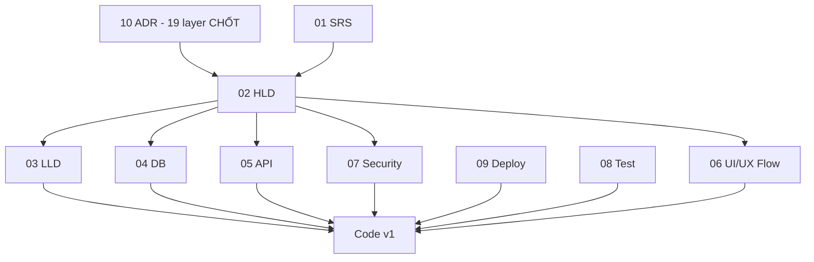

# 11. Project Task Breakdown - Hệ thống đặt vé xe khách

## 1. Thông tin tài liệu

### 1.1. Metadata

| Thuộc tính    | Giá trị                     |
| ------------- | --------------------------- |
| Tên tài liệu  | Project Task Breakdown      |
| Mã tài liệu   | 11-project-task-breakdown   |
| Dự án         | Marketplace-Ve-Xe-Nhanh     |
| Trạng thái    | Approved                    |
| Người viết    | Nguyễn Hồng Khanh, AI Agent |
| Người duyệt   | Nguyễn Hồng Khanh           |
| Ngày tạo      | 11/05/2026                  |
| Ngày cập nhật | 25/09/2026                  |

### 1.2. Lịch sử thay đổi

| Phiên bản | Ngày       | Người cập nhật | Nội dung thay đổi                                                                                                                                                                                                                                                                                                                                                                                                                                                                                                            |
| --------- | ---------- | -------------- | ---------------------------------------------------------------------------------------------------------------------------------------------------------------------------------------------------------------------------------------------------------------------------------------------------------------------------------------------------------------------------------------------------------------------------------------------------------------------------------------------------------------------------- |
| v0.1      | 11/05/2026 | AI Agent       | Tạo bản nháp Project Task Breakdown                                                                                                                                                                                                                                                                                                                                                                                                                                                                                          |
| v0.2      | 25/05/2026 | AI Agent       | Rebrand `Marketplace-Ve-Xe-Nhanh`; cập nhật TASK-FND-001 nguồn                                                                                                                                                                                                                                                                                                                                                                                                                                                               |
| v0.3      | 01/06/2026 | AI Agent       | **Sprint 4 Rework** — bake toàn bộ 19 layer stack (ADR-002 + 009..026). §6 cập nhật trạng thái doc (HLD/DB/LLD/API/Security/Test/Ops rework DONE). §7 task theo module gắn stack: Foundation (Turborepo+pnpm+Render+GitHub Actions+Prisma+BullMQ worker tách), IAM (Better Auth 3-namespace+token+RLS+TOTP+OAuth), BTP (Redis hold+VNPay/MoMo+dedup+escrow+payout manual), NSR (Resend+Expo+sms-noop BullMQ), thêm TASK-TEST (Vitest+Supertest+Playwright+Maestro). §8 DoD thêm money BIGINT/RLS/OpenAPI gen. §10 refine OQ. |
| v0.4      | 08/09/2026 | AI Agent       | **Cascade ADR-028** (Mobile: Expo / React Native → Flutter). §7.5 `TASK-EMP-001` nguồn `ADR-014` → `ADR-028`; §7.6 `TASK-NSR-001` push `Expo` → `FCM/APNs`; §8 DoD Mobile `expo-secure-store` → `flutter_secure_storage` + thêm `integration_test`.                                                                                                                                                                                                                                                                          |
| v0.5      | 09/09/2026 | AI Agent       | Thêm **`TASK-FND-009`** — setup 2 app Flutter (`apps/passenger_mobile` + `apps/employee_mobile`, `packages/mobile_shared/`, Dart client `packages/api_client_dart/` sinh bằng `openapi-generator` pin `v7.25.0`), dependency `TASK-FND-008`. Sửa `TASK-OPS-001`: "EAS mobile" → build mobile Flutter (Android local; iOS tuỳ chọn khi có macOS) — vết Expo còn sót sau cascade v0.4.                                                                                                                                         |
| v0.6      | 17/09/2026 | AI Agent       | Thêm **`TASK-FND-010`** — nền FE web (Tailwind 4 + token VXN + Shadcn/ui + khung layout 3 app), dependency `TASK-FND-001`. Khanh chốt Shadcn/ui cho cả 3 app web (ADR-013). |
| v0.7      | 17/09/2026 | AI Agent       | Rà FE cũ phát hiện 4 nhóm yêu cầu SRS chưa có task chứa → thêm **`TASK-MKT-001`** (profile công khai Operator, FR-MKT-06 + FR-NSR-15), **`TASK-MKT-002`** (hồ sơ hành khách + hành khách thường dùng, FR-IAM-11 + FR-MKT-13), **`TASK-PROM-001`** (promotion, FR-PROM-01..07 + FR-ADM-12), **`TASK-ADM-003`** (kiểm duyệt nội dung, FR-ADM-13). Thu hẹp nguồn `TASK-ADM-002` `FR-ADM-10..17` → `FR-ADM-10..11, 14..17` để FR-ADM-12/13 chỉ thuộc một task. `TASK-FND-010`: layout Marketplace đổi header → sidebar. |
| v0.8      | 21/09/2026 | AI Agent       | Cập nhật `TASK-IAM-004` → **Done** sau khi Khanh xác nhận CI branch xanh; không thay đổi trạng thái Approved của tài liệu.                                                                                                                                                                                                                                                                                                                                                                                                   |
| v0.9      | 23/09/2026 | AI Agent       | Sửa `TASK-DOC-006` về Ready (chờ Khanh): tài liệu 08 vẫn Draft, 09 Approved. `TASK-DOC-008` chỉ yêu cầu tạo tài liệu 12 nên giữ Done. Giảm nhiễu căn lề bảng. |
| v0.10     | 25/09/2026 | AI Agent       | Cập nhật `TASK-IAM-005` → **Done** sau khi Khanh xác nhận CI 5/5 job xanh và PR #10 đã merge; không thay đổi trạng thái Approved của tài liệu. |
| v0.11     | 25/09/2026 | AI Agent       | **Tách §7.3 Transport resource** từ 4 thành 9 task. Lý do: `TASK-TRN-003` gom FR-OPS-06..13 và phụ thuộc vòng với BTP (FR-OPS-11..12 đổi chuyến đã bán vé cần booking + notification, trong khi `TASK-BTP-001` chờ TRN-003); Transport thiếu Catalog (loại xe, điểm đón/trả chuẩn chỉ nằm ở `TASK-ADM-001`). Thêm **`TASK-CAT-001`** (Catalog nền: schema + seed DB-MIG-04 + API đọc), **`TASK-TRN-005`** (Fare), **`TASK-TRN-006`** (vòng đời bán + khóa ghế thủ công), **`TASK-TRN-007`** (lịch lặp lại), **`TASK-TRN-008`** (đổi chuyến đã bán vé). Thu hẹp TRN-003 còn Trip/TripStop/TripSeat; TRN-004 thêm chi tiết chuyến FR-MKT-05 (trước đó chưa task nào chứa). TRN-002 bỏ phụ thuộc TRN-001 (làm song song). `TASK-BTP-001` phụ thuộc TRN-003 → TRN-006. Giữ nguyên ID cũ để không vỡ tham chiếu. |
| v0.12     | 25/09/2026 | AI Agent       | Cập nhật `TASK-FND-010` → **Done** sau khi Khanh xác nhận CI xanh; PR #4 đã merge vào `develop` ngày 18/09/2026. Không thay đổi trạng thái Approved của tài liệu. |
| v0.13     | 25/09/2026 | AI Agent       | Thêm **`TASK-IAM-006`** — web auth cho Operator OS + Platform Admin (first-login password change, TOTP, cookie httpOnly, CSRF, CORS); giữ JSON/Bearer cho Mobile. Đặt làm dependency của `TASK-TRN-001` để màn Xe không triển khai trước luồng đăng nhập web. Thêm `TASK-OQ-05` cho contract cookie/CSRF/CORS còn phải chốt. |
| v0.14     | 25/09/2026 | AI Agent       | **Đóng `TASK-OQ-05`**: chốt `X-Auth-Transport`, cookie host-only, signed double-submit CSRF, exact CORS allowlist/same-site topology và `/auth/csrf` + `/auth/me`; `TASK-IAM-006` chuyển **Draft → Ready**. Đồng bộ 03/05/06/07/08/09; giữ trạng thái phê duyệt hiện có. |
| v0.15     | 25/09/2026 | AI Agent       | `TASK-CAT-001` → **In Progress** sau khi Khanh duyệt Q1–Q4 (endpoint đọc công khai `/catalog/*` ở API §7.6; seed tỉnh/xã từ file danh mục chính thức). Không thay đổi trạng thái Approved của tài liệu. |
| v0.16     | 25/09/2026 | AI Agent       | `TASK-TRN-001` → **In Progress** sau khi Khanh duyệt Q1–Q4 (API §7.3 route chi tiết, DB §5.2 thêm `vehicle_amenities`). Không thay đổi trạng thái Approved của tài liệu. |
| v0.17     | 25/09/2026 | AI Agent       | Bắt đầu **`TASK-TRN-002`** theo yêu cầu của Khanh: tạo todo/guide/checklist và chuyển `Draft → In Progress`. Chưa code trước khi chốt Q1–Q7 về StopPoint/proposal, API, RouteStop/state, Goong, permission và phạm vi FE; giữ trạng thái Approved của tài liệu. |
| v0.18     | 26/09/2026 | AI Agent       | `TASK-TRN-002`: Khanh duyệt Q1–Q8 (thêm Q8 provider ước lượng ở dev); API §7.3, DB §5.2/§7, Security §7, GLOSSARY đồng bộ. Không thay đổi trạng thái Approved của tài liệu. |

---

## 2. Mục lục

1. Thông tin tài liệu
2. Mục lục
3. Giới thiệu
4. Quy ước task
5. Dependency tổng quan
6. Task theo giai đoạn tài liệu
7. Task theo module triển khai
8. Definition of Done
9. Rủi ro kế hoạch
10. Open Questions / TBD

---

## 3. Giới thiệu

Tài liệu này chia nhỏ công việc từ SDLC sang task triển khai, kiểm thử và nghiệm thu. Stack đã chốt 19/19 layer (ADR-002 + ADR-009..027); tham chiếu `01-srs`, `02-hld`, `03-lld`, `04-db`, `05-api`, `07-security`, `08-test`, `09-ops`, `10-adr`. Bản nháp này chưa thay thế issue tracker chính thức.

---

## 4. Quy ước task

| Trường     | Ý nghĩa                                               |
| ---------- | ----------------------------------------------------- |
| Task ID    | `TASK-<GROUP>-NNN`                                    |
| Nguồn      | FR/UC/NFR/BR/ADR/tài liệu liên quan                   |
| Owner      | BE/FE/Mobile/QA/DevOps/Reviewer (v1 solo: Khanh + AI) |
| Dependency | Task hoặc tài liệu cần hoàn thành trước               |
| Status     | Draft / Ready / In Progress / Blocked / Done          |
| DoD        | Điều kiện hoàn thành                                  |

---

## 5. Dependency tổng quan

---

## 6. Task theo giai đoạn tài liệu

Sau Sprint 5 rework + Sprint 4 Phase 4 DevOps, các doc thiết kế đã reset theo 18 ADR — chờ Khanh review/promote.

| Task ID      | Task                                                    | Nguồn           | Owner              | Dependency    | Status            |
| ------------ | ------------------------------------------------------- | --------------- | ------------------ | ------------- | ----------------- |
| TASK-DOC-001 | Review + promote 02 HLD (Review/Approved)               | 02 HLD          | Reviewer           | Rework DONE   | Done              |
| TASK-DOC-002 | Review + promote 04 DB                                  | 04 DB           | Reviewer/BE        | Rework DONE   | Done              |
| TASK-DOC-003 | Review + promote 03 LLD                                 | 03 LLD          | Reviewer/Architect | Rework DONE   | Done              |
| TASK-DOC-004 | Review + promote 05 API                                 | 05 API          | Reviewer/BE        | Rework DONE   | Done              |
| TASK-DOC-005 | Review + promote 07 Security                            | 07 Security     | Reviewer/Security  | Rework DONE   | Done              |
| TASK-DOC-006 | Review + promote 08 Test + 09 Deploy                    | 08 Test, 09 Ops | Reviewer/QA/DevOps | Rework DONE   | Ready (chờ Khanh) |
| TASK-DOC-007 | Hoàn thiện 06 UI/UX flow (User/Operator/Employee/Admin) | 06 UI/UX        | FE/Mobile/Reviewer | TASK-DOC-001  | Done              |
| TASK-DOC-008 | Tạo 12 Release Notes & Change Log (khi vào code)        | —               | Reviewer           | Code v1 start | Done              |

---

## 7. Task theo module triển khai

### 7.1. Foundation

| Task ID      | Task                                                                                                                                                                                                                                                                                                                                                                                                                                              | Nguồn           | Owner  | Dependency   | Status               |
| ------------ | ------------------------------------------------------------------------------------------------------------------------------------------------------------------------------------------------------------------------------------------------------------------------------------------------------------------------------------------------------------------------------------------------------------------------------------------------- | --------------- | ------ | ------------ | -------------------- |
| TASK-FND-001 | Setup monorepo Turborepo + pnpm (`apps/api,marketplace,operator-os,admin,passenger_mobile,employee_mobile` + `packages/*`)                                                                                                                                                                                                                                                                                                                        | ADR-013/014     | DevOps | None         | Done                 |
| TASK-FND-002 | Docker foundation API+Worker (cùng image, khác start cmd `main.ts`/`worker.ts` — ADR-024) + Render Web Service (`apps/api`) + GitHub Actions CI skeleton + secret placeholders. **KHÔNG Render Cron Job riêng** — payout cron = BullMQ `repeat` concurrency 1 trong Worker (ADR-024). Frontend deploy + staging smoke → TASK-OPS-001; full observability (Pino/RFC 7807/Sentry SDK/OTel) → TASK-FND-006                                           | ADR-023/024/026 | DevOps | TASK-FND-001 | Done ( local worker) |
| TASK-FND-003 | Prisma + Postgres + Mongoose + Mongo audit + RLS policy + migration                                                                                                                                                                                                                                                                                                                                                                               | ADR-011         | BE     | TASK-FND-001 | Done                 |
| TASK-FND-004 | Redis Upstash (ioredis) + BullMQ worker process tách + Bull Board                                                                                                                                                                                                                                                                                                                                                                                 | ADR-015/016/024 | BE     | TASK-FND-003 | Done                 |
| TASK-FND-005 | Zod env validation (nestjs-zod) + config theo môi trường                                                                                                                                                                                                                                                                                                                                                                                          | ADR-010         | BE     | TASK-FND-002 | Done                 |
| TASK-FND-006 | Logging Pino + request id + RFC 7807 error + Sentry + OTel                                                                                                                                                                                                                                                                                                                                                                                        | ADR-012/026     | BE     | TASK-FND-005 | Done                 |
| TASK-FND-007 | Audit module base (Mongo append-only) + ESLint boundary rule                                                                                                                                                                                                                                                                                                                                                                                      | ADR-010/011     | BE     | TASK-FND-006 | Done                 |
| TASK-FND-008 | OpenAPI auto-gen (nestjs-zod) + gen api-client (`openapi-typescript`) CI                                                                                                                                                                                                                                                                                                                                                                          | ADR-012         | BE     | TASK-FND-005 | Done                 |
| TASK-FND-009 | **Setup 2 app Flutter**: `flutter create` `apps/passenger_mobile` + `apps/employee_mobile` (`--org com.vexenhanh`, `--project-name` snake_case trùng tên thư mục (quy ước 14/09/2026), `--platforms android,ios`); package Dart dùng chung `packages/mobile_shared/`; Dart client `packages/api_client_dart/` sinh bằng `openapi-generator` **pin v7.25.0** + `dart-dio`; pin Flutter SDK qua FVM; CI job `flutter analyze` + `flutter test` tách khỏi job Node | ADR-028         | Mobile | TASK-FND-008 | Done                 |
| TASK-FND-010 | **Nền FE web** cho `apps/marketplace` + `apps/operator-os` + `apps/admin`: Tailwind CSS 4 + design token VXN (port từ FE cũ) + **Shadcn/ui** trong `packages/ui` (xuất source, `transpilePackages`) + font Be Vietnam Pro + khung layout (sidebar + footer Marketplace theo `CustomerShell` FE cũ; sidebar Operator OS/Admin; mục điều hướng theo 06 UI §5). KHÔNG gồm màn hình nghiệp vụ, auth web (→ `TASK-IAM-006`), API client, phần Employee | ADR-013 | FE | TASK-FND-001 | Done |

### 7.2. IAM

| Task ID      | Task                                                                                                                   | Nguồn                  | Owner        | Dependency   | Status   |
| ------------ | ---------------------------------------------------------------------------------------------------------------------- | ---------------------- | ------------ | ------------ | -------- |
| TASK-IAM-001 | Better Auth + custom NestJS adapter; login 3-namespace (Email/OTP/OAuth + `{slug}/{username}` + `platform/{username}`) | FR-IAM-\*, ADR-017/020 | BE/FE/Mobile | TASK-FND-006 | Done     |
| TASK-IAM-002 | Hybrid token (JWT RS256 15min + opaque refresh 30d rotation/family) + `auth_sessions` + Redis cache                    | ADR-017                | BE           | TASK-IAM-001 | Done     |
| TASK-IAM-003 | RBAC 8-role + TenantGuard (JWT claims) + Postgres RLS                                                                  | FR-IAM-06, ADR-011/017 | BE           | TASK-IAM-002 | Done     |
| TASK-IAM-004 | MFA TOTP (mandatory Owner/PlatformAdmin/PlatformSupport) + backup code                                                 | ADR-017                | BE           | TASK-IAM-002 | Done     |
| TASK-IAM-005 | Closed enrollment provisioning (Platform cấp Operator+Owner; Owner cấp employee) + **FR-IAM-15** (xem danh sách phiên + thu hồi theo thiết bị) — Q1–Q8 được Khanh duyệt ngày 22/09/2026; CI 5/5 job xanh, PR #10 merge ngày 25/09/2026 | ADR-017, FR-IAM-15     | BE/FE        | TASK-IAM-003 | Done     |
| TASK-IAM-006 | **Web auth cho `apps/operator-os` + `apps/admin`**: login đúng namespace; state machine mật khẩu tạm → đổi bắt buộc → login lại → TOTP enrollment/verify + backup code một lần → cookie httpOnly; `GET /auth/csrf` + `/auth/me`; protected route; refresh single-flight; logout/revoke + clear cookie; signed double-submit CSRF; exact CORS allowlist theo contract TASK-OQ-05. Giữ JSON/Bearer cho Mobile. **Không gồm** auth Passenger/Marketplace, Employee mobile, màn nghiệp vụ, provisioning Platform employee, recovery/reset MFA | FR-IAM-02b/02c, FR-IAM-13..16, ADR-017, 05 API §7.1, 06 UI §7/§9, 07 Security §5/§11 | BE/FE/QA | TASK-FND-010, TASK-IAM-004, TASK-IAM-005 | Ready |

### 7.3. Transport resource

Bảng xếp theo thứ tự làm. ID cũ giữ nguyên để không vỡ tham chiếu (`TASK-TRN-002` = Goong ở checklist FND-009; `TASK-TRN-003` ở EMP-001), nên số không trùng thứ tự. Luồng: `CAT-001 → (TRN-001 ∥ TRN-002) → TRN-003 → TRN-005 → TRN-006 → (TRN-004 ∥ TRN-007)`; `TRN-008` chờ thêm BTP-005 + NSR-001.

| Task ID      | Task                                                                                                                                                                                                                                                | Nguồn                                              | Owner | Dependency                             | Status |
| ------------ | --------------------------------------------------------------------------------------------------------------------------------------------------------------------------------------------------------------------------------------------------- | -------------------------------------------------- | ----- | -------------------------------------- | ------ |
| TASK-CAT-001 | **Catalog nền cho Transport**: schema `provinces`, `wards`, `stop_points_catalog`, `vehicle_types`, `amenities` + seed tối thiểu + API đọc cho Operator/Marketplace (05 API mới có `/admin/catalog/*` → cần Khanh duyệt endpoint đọc). Admin quản lý catalog + duyệt StopPoint đề xuất vẫn thuộc `TASK-ADM-001` — Q1–Q4 được Khanh duyệt ngày 25/09/2026 (API §7.6 đọc công khai) | DB-MIG-04, FR-ADM-04 (phần đọc), LLD Catalog       | BE    | TASK-FND-003, TASK-IAM-003             | In Progress |
| TASK-TRN-001 | Vehicle (biển số, `VehicleType`, tiện ích, trạng thái vận hành) + SeatMap/Seat (layout `JSONB`): `/operator/vehicles`, `/operator/seat-maps`; unique `(operator_id, plate_number)` + RLS — Q1–Q4 được Khanh duyệt ngày 25/09/2026 (SeatMap mẫu + tùy chỉnh bằng bản sao; chỉ BE, UI Operator OS làm sau) | FR-OPS-01..03, UC-12                               | BE/FE | TASK-CAT-001                           | In Progress |
| TASK-TRN-002 | Route + RouteStop từ StopPoint chuẩn hoặc StopPoint riêng; đề xuất StopPoint mới (chờ Admin duyệt ở ADM-001); adapter Goong `external/routing/goong/` lưu distance/duration vào DB lúc cấu hình route, không gọi mỗi lần search. Q1–Q8 được Khanh duyệt ngày 26/09/2026 (điểm riêng dùng ngay + đề xuất riêng; `route:manage`; Goong lỗi 503; ước lượng ở dev; chỉ BE) | FR-OPS-04..05, BR-23, BR-38, UC-13, ADR-027 | BE/FE | TASK-CAT-001 | In Progress |
| TASK-TRN-003 | Trip + TripStop + TripSeat (sinh từ SeatMap): tạo chuyến lẻ theo route/ngày giờ/xe ở trạng thái `DRAFT`; chặn một xe chạy hai chuyến trùng giờ hoặc thiếu thời gian quay đầu                                                                           | FR-OPS-06, BR-14                                   | BE/FE | TASK-TRN-001, TASK-TRN-002             | Draft  |
| TASK-TRN-005 | Fare + FareRule theo chuyến / loại ghế / thời điểm, lưu lịch sử giá, VND `BIGINT` không âm; vượt trần/sàn chỉ cảnh báo (OQ-17); giá theo chặng ngoài v1; **test money bắt buộc**                                                                         | FR-OPS-08..09, BR-40..41                           | BE/FE | TASK-TRN-003                           | Draft  |
| TASK-TRN-006 | Vòng đời bán **khi chưa có vé**: kiểm tra đủ điều kiện trước khi mở bán (route, xe/SeatMap, fare, điểm đón/trả, giờ) → mở / khóa / tạm dừng / hủy; khóa / mở ghế thủ công (`BLOCKED`) cho vé bán ngoài Platform                                         | FR-OPS-10, FR-OPS-13, BR-11, BR-39, BR-42          | BE/FE | TASK-TRN-005                           | Draft  |
| TASK-TRN-004 | Search `GET /trips/search`: index Postgres + cache Redis (TTL 60s), chỉ chuyến đang mở bán + còn ghế; lọc/sắp xếp (theo đánh giá bật khi có TRUST-001) + **chi tiết chuyến** `GET /trips/{tripId}`                                                        | FR-MKT-01..05, BR-22, UC-02, ADR-015               | BE/FE | TASK-TRN-006                           | Draft  |
| TASK-TRN-007 | Lịch chuyến lặp lại theo rule; chạy lại không sinh chuyến trùng (05 API chưa có endpoint → cần Khanh duyệt)                                                                                                                                          | FR-OPS-07                                          | BE/FE | TASK-TRN-006                           | Draft  |
| TASK-TRN-008 | Đổi chuyến **đã bán vé**: bắt buộc lý do + audit + thông báo hành khách bị ảnh hưởng; đổi xe phải map được ghế đã bán; hủy chuyến có vé → dừng bán + chặn thanh toán mới + kích hoạt hoàn tiền                                                            | FR-OPS-11..12, BR-10, BR-12, BR-20, UC-14          | BE/FE | TASK-TRN-006, TASK-BTP-005, TASK-NSR-001 | Draft  |

### 7.4. Booking, payment, ticket

| Task ID      | Task                                                                                            | Nguồn                  | Owner        | Dependency                 | Status |
| ------------ | ----------------------------------------------------------------------------------------------- | ---------------------- | ------------ | -------------------------- | ------ |
| TASK-BTP-001 | SeatHold Redis `SET NX EX 600` + Lua EVAL ownership                                             | FR-BTP-01..03, ADR-015 | BE           | TASK-TRN-006, TASK-FND-004 | Draft  |
| TASK-BTP-002 | Booking snapshot + total calculation (BIGINT/Decimal)                                           | FR-BTP-05..06, ADR-009 | BE/FE        | TASK-BTP-001               | Draft  |
| TASK-BTP-003 | PaymentGateway adapter VNPay (SHA512) + MoMo (SHA256) + webhook BullMQ + dedup `(provider,txn)` | FR-BTP-07..09, ADR-019 | BE           | TASK-BTP-002               | Draft  |
| TASK-BTP-004 | Ticket issuance + QR token hash                                                                 | FR-BTP-10..11          | BE/FE/Mobile | TASK-BTP-003               | Draft  |
| TASK-BTP-005 | Cancel/refund request flow (policy snapshot)                                                    | FR-BTP-12..14          | BE/FE        | TASK-BTP-004               | Draft  |
| TASK-BTP-006 | EscrowLedger append-only + commission 5% + payout T+3 manual (BullMQ cron concurrency 1)        | FR-BTP-15..17, ADR-022 | BE/FE        | TASK-BTP-003               | Draft  |

### 7.5. Operator, Employee, Admin, Trust

| Task ID        | Task                                                     | Nguồn                    | Owner     | Dependency                 | Status |
| -------------- | -------------------------------------------------------- | ------------------------ | --------- | -------------------------- | ------ |
| TASK-OPR-001   | Operator onboarding/KYC (R2 private + presigned)/profile | FR-OPR-01..06, ADR-018   | BE/FE     | TASK-IAM-005               | Draft  |
| TASK-OPR-002   | Operator finance dashboard (escrow/payout view)          | FR-OPR-07..09            | BE/FE     | TASK-BTP-006               | Draft  |
| TASK-EMP-001   | Employee assignment/passenger list (employee_mobile)     | FR-EMP-01..06, ADR-028   | BE/Mobile | TASK-IAM-005, TASK-TRN-003 | Draft  |
| TASK-EMP-002   | QR check-in + trip status (Maestro test)                 | FR-EMP-07..13            | BE/Mobile | TASK-BTP-004, TASK-EMP-001 | Draft  |
| TASK-ADM-001   | Admin KYC approve/catalog/policy                         | FR-ADM-02..09            | BE/FE     | TASK-IAM-005               | Draft  |
| TASK-ADM-002   | Admin payment/refund/payout confirm/dispute/audit        | FR-ADM-10..11, FR-ADM-14..17, FR-DSP-\* | BE/FE     | TASK-BTP-005, TASK-FND-007 | Draft  |
| TASK-TRUST-001 | Review/support/complaint/dispute workflow                | FR-NSR-06..11, FR-DSP-\* | BE/FE     | TASK-BTP-004               | Draft  |
| TASK-MKT-001   | Profile công khai Operator: thông tin, đánh giá, scorecard, tuyến tiêu biểu, điều khoản dịch vụ | FR-MKT-06, FR-NSR-15, UC-03 | BE/FE | TASK-OPR-001, TASK-TRUST-001 | Draft |
| TASK-MKT-002   | Hồ sơ hành khách + lưu hành khách thường dùng để đặt vé nhanh | FR-IAM-11, FR-MKT-13, UC-01 | BE/FE | TASK-IAM-003 | Draft |
| TASK-PROM-001  | Promotion cấp Platform / Operator: rule + guardrail + giới hạn lượt dùng + redemption snapshot vào booking; màn quản lý (Admin, Operator OS) + nhập mã ở checkout; **test money bắt buộc** | FR-PROM-01..07, FR-ADM-12, FR-MKT-10, UC-33 | BE/FE | TASK-BTP-002, TASK-IAM-003 | Draft |
| TASK-ADM-003   | Kiểm duyệt nội dung: review, báo cáo vi phạm, banner, FAQ, content page (ảnh qua R2 bucket public) + hiển thị banner/FAQ ở Marketplace | FR-ADM-13, UC-28, ADR-018 | BE/FE | TASK-TRUST-001, TASK-IAM-003 | Draft |

### 7.6. Notification, reporting, operation, test

| Task ID       | Task                                                                                                                                    | Nguồn                  | Owner        | Dependency   | Status |
| ------------- | --------------------------------------------------------------------------------------------------------------------------------------- | ---------------------- | ------------ | ------------ | ------ |
| TASK-NSR-001  | Notification fan-out BullMQ (Resend email + FCM/APNs push + sms-noop) + retry + DLQ                                                     | FR-NSR-01..05, ADR-020 | BE           | TASK-FND-004 | Draft  |
| TASK-NSR-002  | Notification preference + `notification_log` Mongo                                                                                      | FR-NSR-14              | BE/FE/Mobile | TASK-NSR-001 | Draft  |
| TASK-RPT-001  | Operator reporting (Postgres CTE/materialized view)                                                                                     | FR-NSR-12, ADR-011     | BE/FE        | TASK-BTP-006 | Draft  |
| TASK-RPT-002  | Admin reporting + Mongo audit aggregation                                                                                               | FR-NSR-13              | BE/FE        | TASK-RPT-001 | Draft  |
| TASK-OPS-001  | Deployment pipeline Render + GitHub Actions + staging smoke + build mobile Flutter (Android local; iOS tuỳ chọn khi có macOS — ADR-028) | 09 Ops, ADR-023/026    | DevOps/BE    | TASK-FND-002 | Draft  |
| TASK-TEST-001 | Setup Vitest + Supertest + Playwright + Maestro + Testcontainers; mandatory test money/idempotency/tenant-RLS                           | 08 Test, ADR-025       | QA/BE        | TASK-FND-002 | Draft  |

---

## 8. Definition of Done

| Nhóm task | DoD tối thiểu                                                                                                                                     |
| --------- | ------------------------------------------------------------------------------------------------------------------------------------------------- |
| Backend   | FR/UC linked, Zod DTO validation, service logic, Prisma schema/index/RLS, RBAC/ownership, RFC 7807 error code, money BIGINT/Decimal, Vitest tests |
| Frontend  | API contract (gen client) linked, loading/error/empty/permission state, responsive, Zod form validation                                           |
| Mobile    | `flutter_secure_storage` token, offline/sync state nếu có, permission state, `integration_test` + Maestro E2E critical flow                       |
| Database  | Prisma schema/index/RLS reviewed, migration/rollback, seed data nếu cần                                                                           |
| Security  | RBAC/RLS/ownership test, audit log (Mongo), no sensitive logging, webhook HMAC                                                                    |
| QA        | Test case (Vitest/Supertest/Playwright/Maestro), evidence, regression, critical pass                                                              |
| DevOps    | Render config/secret (env group), GitHub Actions CI/CD, Sentry, deployment checklist, rollback                                                    |

---

## 9. Rủi ro kế hoạch

| Rủi ro                          | Tác động                           | Giảm thiểu                                                                                |
| ------------------------------- | ---------------------------------- | ----------------------------------------------------------------------------------------- |
| SeatHold race condition         | Bán trùng ghế                      | Redis SET NX EX + Lua EVAL + test concurrency bắt buộc; hybrid Postgres defer nếu đo được |
| Money rounding                  | Sai tiền commission/refund/payout  | BIGINT/Decimal + lint cấm float + test mandatory (ADR-009/011)                            |
| Tenant leak                     | Operator xem dữ liệu nhau          | TenantGuard + Postgres RLS + test RLS bắt buộc                                            |
| Webhook spoofing/trùng          | Ghi tiền sai                       | HMAC verify + dedup `(provider,txn)` (ADR-019)                                            |
| **OQ-22 giấy phép TGTT**        | Chặn production escrow/payout thật | Sandbox/MVP không vướng; production prep (defer)                                          |
| **OQ-21 KYC storage residency** | Chặn production KYC                | dev-local adapter; production VN-cloud/DPIA (defer)                                       |

---

## 10. Open Questions / TBD

| ID         | Câu hỏi                                                      | Tác động    | Trạng thái                                                                 |
| ---------- | ------------------------------------------------------------ | ----------- | -------------------------------------------------------------------------- |
| TASK-OQ-01 | Issue tracker chính thức?                                    | Task sync   | Khuyến nghị **GitHub Issues** (đồng bộ GitHub Actions ADR-026); Khanh chốt |
| TASK-OQ-02 | Ưu tiên release MVP Marketplace trước hay Operator OS trước? | Sprint plan | Mở (product decision)                                                      |
| TASK-OQ-03 | Owner từng nhóm BE/FE/Mobile/QA/DevOps?                      | Assignment  | v1 solo Khanh + AI                                                         |
| TASK-OQ-04 | Chia milestone theo module hay end-to-end flow?              | Roadmap     | Mở                                                                         |
| TASK-OQ-05 | Contract dual-mode cho `TASK-IAM-006`: transport, cookie, CSRF, CORS, topology và session bootstrap? | API/Security/FE | **Đóng 25/09/2026**: `X-Auth-Transport` explicit (default Bearer); `vxn_access`/`vxn_refresh` host-only; signed double-submit `vxn_csrf`; exact credentialed CORS + same-site domain; thêm `/auth/csrf`, `/auth/me`; chi tiết normative ở 05 API §7.1.1–§7.1.2 và 07 Security §5.1 |

---

### Quy ước mã trong Task Breakdown

- `TASK-<GROUP>-NNN`: Task triển khai.
- `TASK-OQ-NN`: Câu hỏi mở của Task Breakdown.
