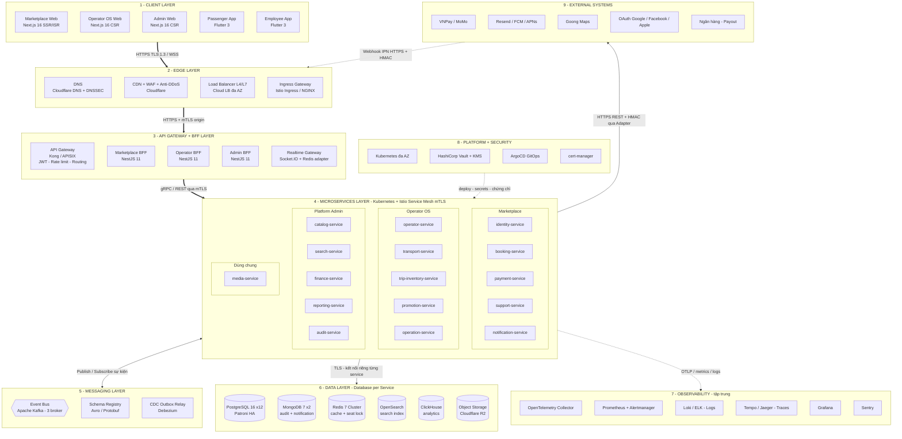
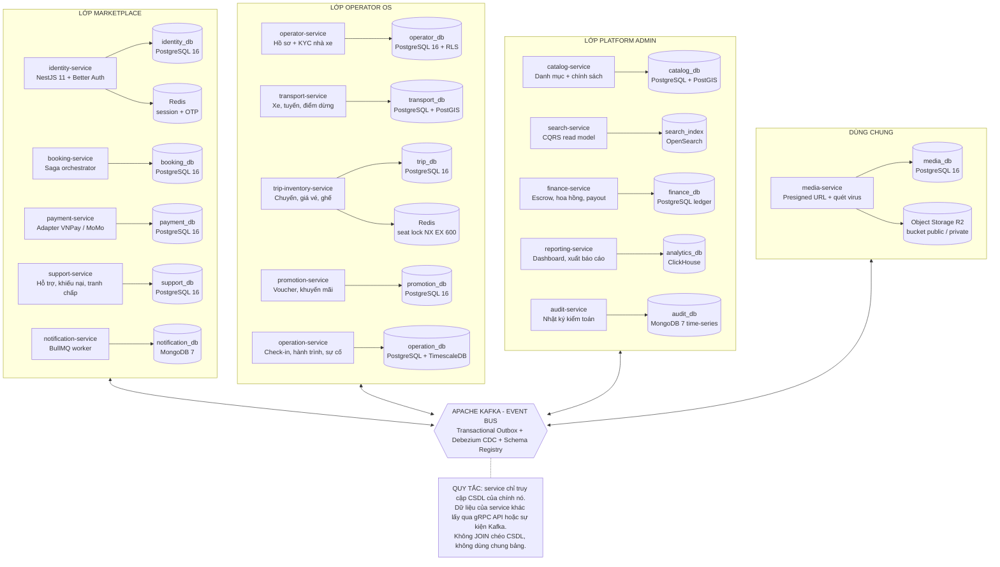
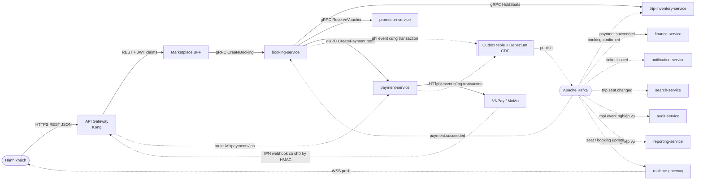
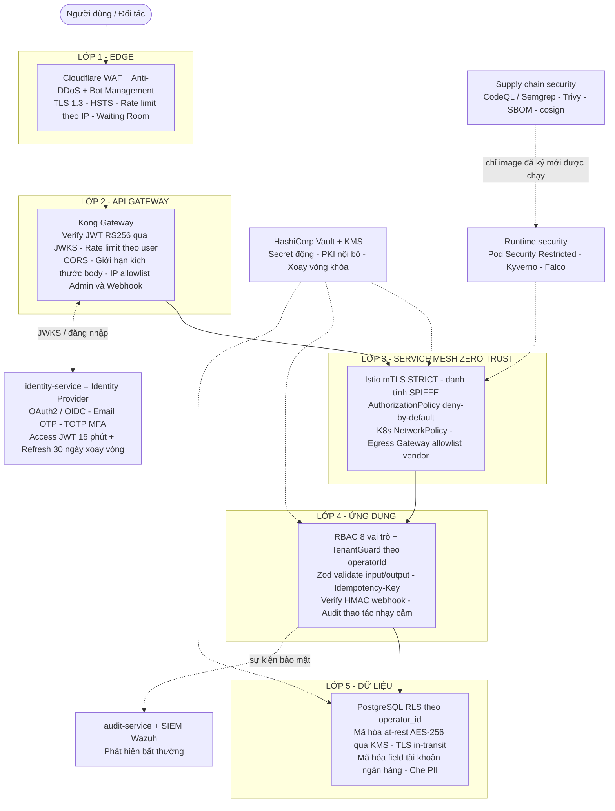
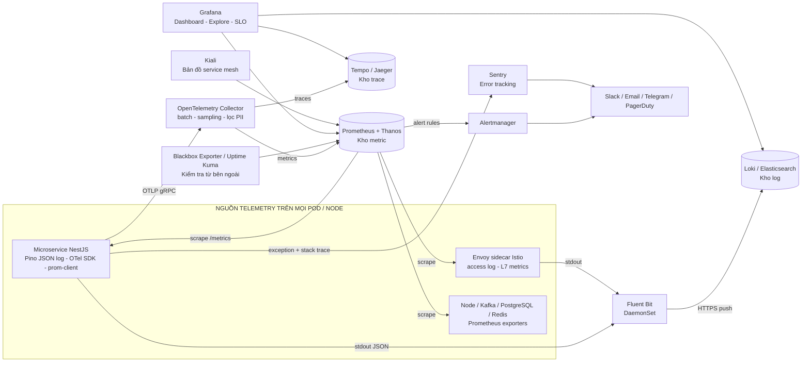
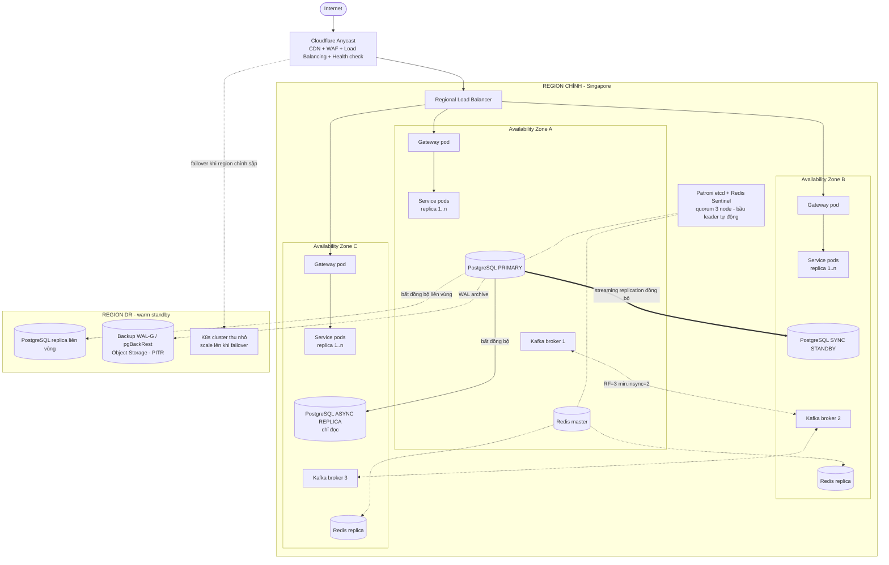
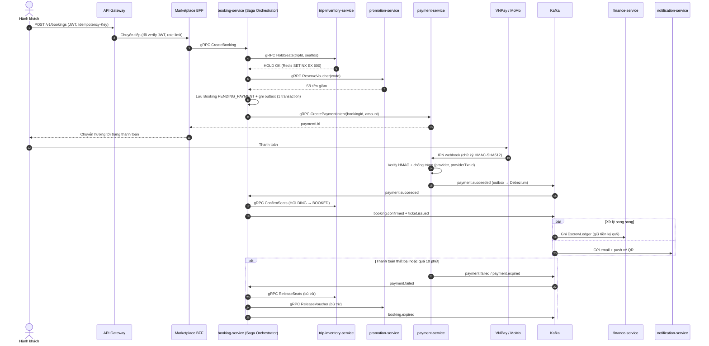
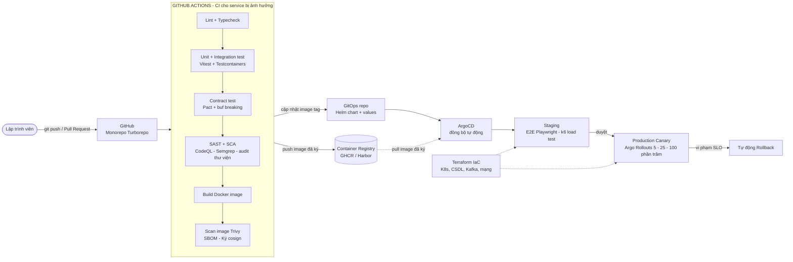

# BÀI THỰC HÀNH SỐ 2 — KIẾN TRÚC DỊCH VỤ VI MÔ (MICROSERVICES)

| Mục | Nội dung |
| --- | --- |
| **Đề tài** | **Marketplace-Ve-Xe-Nhanh** — Sàn thương mại điện tử bán vé xe khách liên tỉnh (managed marketplace ba bên: Hành khách ↔ Nền tảng ↔ Nhà xe) |
| **Sinh viên** | Nguyễn Hồng Khanh |
| **MSSV / Lớp** | ………………… / ………………… |
| **Ngày** | 27/09/2026 |
| **Sản phẩm nộp** | (1) Bản vẽ kiến trúc — 8 hình Mermaid, mỗi hình kèm mô tả bằng văn bản · (2) Tên, chức năng, vai trò, công nghệ của từng thành phần · (3) Công nghệ/kỹ thuật kết nối giữa các thành phần |

---

## Mục lục

1. [Giới thiệu đề tài](#1-giới-thiệu-đề-tài)
2. [Tiêu chuẩn kiến trúc và giải pháp tổng quát](#2-tiêu-chuẩn-kiến-trúc-và-giải-pháp-tổng-quát)
3. [Bản vẽ kiến trúc (sản phẩm C.1)](#3-bản-vẽ-kiến-trúc-sản-phẩm-c1)
4. [Tên, chức năng, vai trò của từng thành phần (sản phẩm C.2)](#4-tên-chức-năng-vai-trò-của-từng-thành-phần-sản-phẩm-c2)
5. [Công nghệ, kỹ thuật kết nối và giao tiếp giữa các thành phần (yêu cầu B.c)](#5-công-nghệ-kỹ-thuật-kết-nối-và-giao-tiếp-giữa-các-thành-phần-yêu-cầu-bc)
6. [Các mẫu thiết kế (pattern) microservices được áp dụng](#6-các-mẫu-thiết-kế-pattern-microservices-được-áp-dụng)
7. [Phân tích mức đáp ứng từng tiêu chuẩn](#7-phân-tích-mức-đáp-ứng-từng-tiêu-chuẩn)
8. [Mở rộng: cấu trúc service, kiểm thử, môi trường](#8-mở-rộng-cấu-trúc-service-kiểm-thử-môi-trường)
9. [Lộ trình chuyển từ modular monolith (v1) sang microservices](#9-lộ-trình-chuyển-từ-modular-monolith-v1-sang-microservices)
10. [Đánh đổi và rủi ro](#10-đánh-đổi-và-rủi-ro)
11. [Kết luận](#11-kết-luận)
12. [Phụ lục](#phụ-lục)

---

## 1. Giới thiệu đề tài

### 1.1. Mô tả hệ thống

**Marketplace-Ve-Xe-Nhanh** là sàn bán vé xe khách theo mô hình _managed marketplace_: nền tảng đứng giữa hành khách và nhà xe, thu tiền hộ, giữ tiền trong ví ký quỹ (escrow), trừ hoa hồng rồi chi trả cho nhà xe sau chuyến đi (T+3). Hệ thống có **ba lớp dịch vụ**:

| Lớp dịch vụ | Người dùng | Nghiệp vụ chính |
| --- | --- | --- |
| **Marketplace** | Hành khách (Passenger), Khách vãng lai (Guest) | Tìm chuyến, chọn ghế, giữ ghế 10 phút, đặt vé, thanh toán VNPay/MoMo, nhận vé QR, hủy/hoàn vé, đánh giá, khiếu nại |
| **Operator OS** | Chủ nhà xe (Owner), Nhân viên (Tài xế, Soát vé, CSKH) | Quản lý xe, sơ đồ ghế, tuyến, điểm đón trả, lập chuyến, giá vé, khuyến mãi, nhân viên; check-in QR, nhật ký hành trình, báo sự cố; xem doanh thu, đối soát |
| **Platform Admin** | Quản trị nền tảng (PlatformAdmin, PlatformSupport) | Duyệt KYC nhà xe, danh mục dùng chung, chính sách hủy/hoàn, hoa hồng, chi trả nhà xe (payout), xử lý tranh chấp, báo cáo, nhật ký kiểm toán |

### 1.2. Tác nhân và hệ thống bên ngoài

| Nhóm | Tác nhân / hệ thống | Kênh truy cập |
| --- | --- | --- |
| Người dùng cuối | Guest, Passenger | Web Marketplace, App Passenger (Flutter) |
| Nhà xe (tenant) | OperatorOwner, Driver, TicketStaff, SupportStaff | Web Operator OS, App Employee (Flutter) |
| Nền tảng | PlatformAdmin, PlatformSupport | Web Admin |
| Thanh toán | VNPay (chính), MoMo (phương thức 2) | REST + Webhook/IPN |
| Thông báo | Resend (email), Firebase Cloud Messaging + APNs (push), SMS (dự phòng) | REST / HTTP/2 |
| Bản đồ | Goong Maps (định tuyến, khoảng cách, geocoding — hiển thị đúng chủ quyền Hoàng Sa, Trường Sa) | REST |
| Đăng nhập mạng xã hội | Google, Facebook, Apple | OAuth 2.0 / OIDC |
| Lưu trữ file | Cloudflare R2 (S3-compatible) | S3 API |
| Ngân hàng | Chuyển khoản chi trả cho nhà xe | Xuất lô + xác nhận thủ công (v1), chi hộ tự động (tương lai) |

### 1.3. Đặc thù nghiệp vụ chi phối kiến trúc

| Đặc thù nghiệp vụ | Hệ quả lên kiến trúc |
| --- | --- |
| **Tranh chấp ghế giờ cao điểm** (Tết, lễ: tải có thể gấp 10–20 lần ngày thường) | Tách `trip-inventory-service` để scale độc lập; khóa phân tán Redis chống bán trùng ghế (overbooking); phòng chờ ảo (waiting room) ở CDN |
| **Dòng tiền ba bên** (thu hộ → escrow → hoa hồng → chi trả T+3) | Tách `payment-service` (tiền vào) và `finance-service` (tiền ra); sổ cái chỉ-ghi-thêm (append-only); idempotent; tiền lưu `BIGINT` VND, tính bằng Decimal |
| **Đa thuê bao (multi-tenant)** — nhiều nhà xe dùng chung hệ thống | Cô lập dữ liệu theo `operatorId` ở cả tầng ứng dụng (TenantGuard) và tầng CSDL (PostgreSQL Row-Level Security) |
| **Nhân viên làm việc trên xe, mạng yếu** | `operation-service` riêng; app Employee offline-first; kênh realtime đẩy trạng thái chuyến |
| **Đọc nhiều hơn ghi rất nhiều** (tìm chuyến ≫ đặt vé) | CQRS: `search-service` có mô hình đọc riêng trên OpenSearch + cache |
| **Nhiều nhà cung cấp bên thứ ba ở Việt Nam** | Lớp adapter chống phụ thuộc (Anti-Corruption Layer) + circuit breaker cho từng vendor |
| **Dữ liệu nhạy cảm** (KYC, tài khoản ngân hàng, thông tin cá nhân — Nghị định 13/2023/NĐ-CP) | Mã hóa khi lưu và khi truyền, bucket riêng tư, URL ký tạm thời, nhật ký kiểm toán mọi lần truy cập |

### 1.4. Phạm vi và giả định

- Bài này thiết kế **kiến trúc mục tiêu (target state)** theo microservices. Bản v1 đang được code là **modular monolith** (ADR-002) nhưng đã chia module đúng theo các _bounded context_ dưới đây, ranh giới được ép bằng công cụ lint → chính là nền để tách dần thành microservices theo mẫu **Strangler Fig** (mục 9).
- **Giả định định cỡ (sizing)** để lập luận về khả năng mở rộng: ~100.000 người dùng đồng thời giờ cao điểm, ~1.000 booking/phút lúc đỉnh Tết, hàng trăm nhà xe.
- **Hạ tầng**: cloud vùng Singapore (độ trễ tới Việt Nam ~30–50 ms), Kubernetes managed, trải trên 3 Availability Zone (AZ).
- **Ngôn ngữ**: TypeScript (Node.js 24) cho toàn bộ service — thống nhất với dự án; kiến trúc vẫn cho phép viết service "nóng" bằng Go/Java nếu cần (polyglot) vì giao tiếp qua hợp đồng chuẩn (gRPC/Protobuf, Kafka/Schema Registry).

---

## 2. Tiêu chuẩn kiến trúc và giải pháp tổng quát

Bảng truy vết (traceability) từ **7 tiêu chuẩn của đề bài (mục A)** tới giải pháp và thành phần hiện thực:

| # | Tiêu chuẩn (mục A) | Giải pháp kiến trúc chính | Thành phần hiện thực | Chi tiết |
| --- | --- | --- | --- | --- |
| 1 | **Bảo mật cao** | Phòng thủ nhiều lớp (defense-in-depth, 5 lớp) + Zero Trust giữa các service | Cloudflare WAF, API Gateway, `identity-service` (IdP), Istio mTLS, Vault, PostgreSQL RLS | Hình 4, §7.1 |
| 2 | **Khả năng mở rộng** | Service phi trạng thái (stateless) scale ngang độc lập; hướng sự kiện; CQRS; cache; phân vùng dữ liệu | Kubernetes HPA + KEDA, Kafka partition, Redis Cluster, OpenSearch, CDN | Hình 1, §7.2 |
| 3 | **Dễ bảo trì** | Tách theo bounded context (DDD); kiến trúc lục giác trong từng service; contract-first; CI/CD độc lập từng service | 16 service, OpenAPI 3.1 + Protobuf, Schema Registry, GitOps | Hình 8, §7.3 |
| 4 | **Mỗi dịch vụ 1 CSDL riêng** | Database per Service + Polyglot Persistence; nhất quán dữ liệu qua Saga + Transactional Outbox | 12 CSDL PostgreSQL, 2 MongoDB, OpenSearch, ClickHouse | Hình 2, §7.4 |
| 5 | **Tính sẵn sàng cao** | Dự phòng N+1 trên 3 AZ, failover tự động, circuit breaker, suy giảm có kiểm soát, vùng DR | K8s multi-AZ, Patroni, Kafka RF=3, Redis Sentinel, Argo Rollouts | Hình 6, §7.5 |
| 6 | **Logging & monitoring tập trung** | 3 trụ cột observability (log – metric – trace) + theo dõi lỗi + cảnh báo theo SLO | OpenTelemetry, Fluent Bit, Loki/ELK, Prometheus, Tempo/Jaeger, Grafana, Sentry | Hình 5, §7.6 |
| 7 | **Hệ thống phân tán** | Giao tiếp mạng có kiểm soát (timeout/retry/idempotency), nhất quán cuối (eventual consistency), service discovery, truy vết phân tán | Istio/Envoy, Kafka, CoreDNS, OpenTelemetry | Hình 3, Hình 7, §7.7 |

---

## 3. Bản vẽ kiến trúc (sản phẩm C.1)

Kiến trúc được trình bày bằng **8 hình**, mỗi hình là một _góc nhìn (view)_ để bản vẽ không bị rối:

| Hình | Góc nhìn | Trả lời câu hỏi |
| --- | --- | --- |
| Hình 1 | Tổng thể (các lớp) | Hệ thống gồm những lớp/thành phần nào, nối với nhau bằng gì? |
| Hình 2 | Microservices + CSDL riêng | Có những service nào, mỗi service sở hữu CSDL gì? |
| Hình 3 | Giao tiếp đồng bộ / bất đồng bộ | Service nói chuyện với nhau bằng giao thức gì? |
| Hình 4 | Bảo mật nhiều lớp | Request đi qua những lớp bảo vệ nào? |
| Hình 5 | Logging & monitoring tập trung | Log, metric, trace được thu thập và hiển thị ra sao? |
| Hình 6 | Triển khai sẵn sàng cao | Hệ thống sống sót khi hỏng 1 máy / 1 AZ / 1 vùng thế nào? |
| Hình 7 | Luồng đặt vé (Saga) | Một giao dịch trải qua nhiều service và nhiều CSDL được giữ nhất quán thế nào? |
| Hình 8 | CI/CD & DevOps (mở rộng) | Code đi từ máy lập trình viên tới production ra sao? |

**Quy ước ký hiệu:** hình chữ nhật = thành phần xử lý · hình trụ = kho dữ liệu · lục giác = message broker · **mũi tên liền** = gọi đồng bộ · **mũi tên nét đứt** = bất đồng bộ / sự kiện / luồng phụ · **mũi tên đậm** = luồng request chính.

### 3.1. Hình 1 — Kiến trúc tổng thể



**Mô tả Hình 1.** Kiến trúc chia thành **9 lớp**, request của người dùng đi từ trên xuống:

1. **Client layer** — 5 ứng dụng: 3 web Next.js (Marketplace cho hành khách, Operator OS cho nhà xe, Admin cho nền tảng) và 2 app Flutter (Passenger, Employee). Client **không bao giờ** gọi thẳng microservice; mọi request đều đi qua Edge và API Gateway.
2. **Edge layer** — DNS phân giải tên miền; Cloudflare làm CDN (cache trang tĩnh/ảnh), WAF (chặn SQL injection, XSS, bot) và chống DDoS; Load Balancer phân phối tải vào cụm Kubernetes trên nhiều AZ; Ingress Gateway là cửa vào cụm.
3. **API Gateway + BFF layer** — API Gateway là _điểm vào duy nhất_: xác thực JWT, giới hạn tần suất (rate limit), định tuyến `/v1/*`. Sau gateway có **3 BFF** (Backend-for-Frontend), mỗi BFF phục vụ một nhóm client và gộp dữ liệu từ nhiều service thành một response. Realtime Gateway giữ kết nối WebSocket để đẩy trạng thái ghế, check-in, vị trí xe.
4. **Microservices layer** — **16 service nghiệp vụ** chia theo 3 lớp dịch vụ của đề tài + 1 service dùng chung; tất cả chạy trên Kubernetes, giao tiếp nội bộ qua **Istio service mesh** có mã hóa mTLS.
5. **Messaging layer** — Apache Kafka là xương sống sự kiện (event bus); Schema Registry quản lý phiên bản schema sự kiện; Debezium đọc bảng _outbox_ của từng CSDL để phát sự kiện tin cậy.
6. **Data layer** — mỗi service có CSDL riêng (Hình 2): PostgreSQL cho dữ liệu giao dịch, MongoDB cho nhật ký, Redis cho cache/khóa, OpenSearch cho tìm kiếm, ClickHouse cho phân tích, R2 cho file.
7. **Observability** — toàn bộ log, metric, trace, lỗi đổ về một chỗ để quan sát (Hình 5).
8. **Platform + Security** — Kubernetes điều phối container; Vault cấp bí mật (mật khẩu DB, khóa API); ArgoCD triển khai theo GitOps; cert-manager tự cấp/gia hạn chứng chỉ TLS.
9. **External systems** — cổng thanh toán, email/push, bản đồ, OAuth, ngân hàng; chỉ được gọi qua **adapter** trong service tương ứng. Cổng thanh toán gọi ngược (webhook/IPN) vào hệ thống **qua Edge + Gateway** như mọi request khác, có chữ ký HMAC.

### 3.2. Hình 2 — Microservices và nguyên tắc "mỗi dịch vụ một CSDL riêng"



**Mô tả Hình 2.**

- Hệ thống có **16 microservice**, mỗi service ứng với **một bounded context** trong thiết kế miền của đề tài (DOMAIN-MAP), nên ranh giới service trùng với ranh giới nghiệp vụ — không cắt theo kỹ thuật (kiểu "service DB", "service util").
- **Mỗi service sở hữu độc quyền CSDL của mình** (16 kho dữ liệu chính). Không service nào được kết nối vào CSDL của service khác: muốn dữ liệu thì **hỏi qua API** (gRPC) hoặc **nghe sự kiện** (Kafka) rồi lưu bản sao cục bộ cần thiết. Nhờ vậy mỗi service đổi schema, đổi công nghệ, scale, deploy độc lập.
- **Polyglot persistence** — chọn loại CSDL hợp với dữ liệu:
  - _PostgreSQL 16_ (12 CSDL) cho dữ liệu giao dịch cần ACID: booking, payment, ledger tài chính, chuyến/ghế…; thêm **PostGIS** cho tọa độ điểm đón trả, **TimescaleDB** cho chuỗi thời gian GPS hành trình; **Row-Level Security** cô lập dữ liệu từng nhà xe.
  - _MongoDB 7_ cho log thông báo và nhật ký kiểm toán (ghi nhiều, append-only, schema linh hoạt).
  - _Redis_ cho session/OTP (identity) và **khóa giữ ghế** `SET seat:{tripId}:{seatId} {bookingId} NX EX 600` (trip-inventory).
  - _OpenSearch_ cho tìm kiếm full-text + lọc đa tiêu chí; _ClickHouse_ cho truy vấn phân tích cột (OLAP); _R2_ cho file.
- **Mức cô lập vật lý** (đánh đổi chi phí): service lõi giao dịch (`booking`, `payment`, `finance`, `trip-inventory`, `identity`) dùng **instance CSDL riêng**; service nhỏ có thể dùng chung cụm PostgreSQL nhưng **database + user + mật khẩu riêng** (mẫu _database-server-per-service_ và _database-per-service_ của Chris Richardson) — vẫn thỏa "mỗi dịch vụ một CSDL".
- Toàn bộ service nối với **Kafka** hai chiều (phát và nhận sự kiện). Sự kiện được ghi vào bảng _outbox_ **trong cùng transaction** với dữ liệu nghiệp vụ, sau đó Debezium đọc WAL của PostgreSQL để đẩy lên Kafka → không bao giờ có chuyện "đã lưu DB nhưng mất sự kiện".

### 3.3. Hình 3 — Giao tiếp đồng bộ và bất đồng bộ (ví dụ luồng đặt vé)



**Mô tả Hình 3.** Hệ thống dùng **hai kiểu giao tiếp**, chọn theo nhu cầu nhất quán:

- **Đồng bộ (mũi tên liền) — REST ở biên, gRPC ở nội bộ.** Client → Gateway → BFF dùng REST/JSON (dễ dùng cho web/mobile, có OpenAPI 3.1). BFF → service và service → service dùng **gRPC** (HTTP/2 + Protobuf: nhị phân, nhanh, có hợp đồng chặt). Chỉ dùng đồng bộ khi **cần câu trả lời ngay** để quyết định: giữ ghế còn trống không (`HoldSeats`), voucher còn hợp lệ không (`ReserveVoucher`), tạo link thanh toán (`CreatePaymentIntent`). Mọi lời gọi gRPC có **deadline/timeout, retry giới hạn, circuit breaker** (do Envoy sidecar của Istio thực thi).
- **Bất đồng bộ (mũi tên nét đứt) — sự kiện qua Kafka.** Sau khi thanh toán thành công, `payment-service` **không gọi lần lượt** booking, finance, notification… mà chỉ phát một sự kiện `payment.succeeded`. Service nào quan tâm thì tự đăng ký nhận (publish/subscribe). Nhờ đó: thêm service mới (ví dụ chương trình tích điểm) **không phải sửa** payment-service; nếu notification-service đang hỏng thì việc thanh toán vẫn thành công, email sẽ gửi khi service sống lại (Kafka giữ sự kiện).
- **Webhook từ cổng thanh toán** (IPN) đi vào qua Gateway trên route riêng, có IP allowlist; `payment-service` kiểm tra chữ ký HMAC-SHA512 (VNPay) / HMAC-SHA256 (MoMo), chống xử lý trùng bằng khóa `(provider, providerTxnId)`, trả `200` ngay rồi xử lý tiếp bất đồng bộ.
- **Realtime**: `realtime-gateway` nghe sự kiện Kafka và đẩy xuống trình duyệt/app qua WebSocket (WSS) — ví dụ ghế vừa bị người khác giữ sẽ đổi màu ngay trên sơ đồ ghế.

### 3.4. Hình 4 — Kiến trúc bảo mật nhiều lớp (Defense-in-Depth + Zero Trust)



**Mô tả Hình 4.** Mỗi request phải vượt qua **5 lớp kiểm soát độc lập**; kẻ tấn công vượt được một lớp vẫn bị lớp sau chặn:

1. **Edge**: Cloudflare chặn tấn công phổ biến (OWASP Top 10), bot đặt giữ ghế hàng loạt, DDoS; ép HTTPS TLS 1.3 + HSTS. _Waiting Room_ xếp hàng người dùng khi mở bán vé Tết để hệ thống không sập.
2. **API Gateway**: kiểm tra chữ ký JWT (RS256) bằng khóa công khai lấy từ JWKS của `identity-service` — request không có token hợp lệ bị chặn **trước khi** chạm vào service; rate limit theo user/IP (đăng nhập, OTP, giữ ghế, thanh toán); trang Admin và endpoint webhook chỉ nhận từ IP cho phép.
3. **Service mesh (Zero Trust)**: không tin mạng nội bộ — mọi kết nối service↔service đều **mTLS** với danh tính riêng; chính sách _deny-by-default_ chỉ cho phép đúng các cặp gọi đã khai báo (ví dụ chỉ `booking-service` được gọi `HoldSeats`); Egress Gateway chỉ cho phép đi ra đúng domain vendor (chống SSRF, rò dữ liệu).
4. **Ứng dụng**: phân quyền RBAC 8 vai trò; TenantGuard đảm bảo nhân viên nhà xe A không đọc được dữ liệu nhà xe B; validate mọi input bằng Zod; thao tác tiền có Idempotency-Key; thao tác nhạy cảm (hoàn tiền, payout, đổi tài khoản ngân hàng) yêu cầu TOTP và ghi audit.
5. **Dữ liệu**: PostgreSQL RLS là "chốt chặn cuối" nếu code quên lọc `operatorId`; mã hóa khi lưu (AES-256, khóa quản lý bởi KMS) và khi truyền (TLS); số tài khoản ngân hàng mã hóa cấp trường; số điện thoại hiển thị che (`0*** *** 789`).

Bổ trợ xuyên suốt: **Vault** cấp mật khẩu CSDL động (tự hết hạn) thay cho mật khẩu cứng trong code; **supply chain security** quét mã nguồn, thư viện, image và ký số image; **runtime security** chặn container chạy quyền root và phát hiện hành vi lạ; **audit-service + SIEM** tương quan sự kiện bảo mật.

### 3.5. Hình 5 — Hệ thống logging và monitoring tập trung



**Mô tả Hình 5.** Với hệ phân tán, một request đi qua 5–7 service; nếu mỗi service tự ghi log trên máy riêng thì không thể điều tra lỗi. Vì vậy mọi tín hiệu được **thu gom về một nơi** theo 3 trụ cột:

- **Logs**: service ghi log **JSON có cấu trúc** ra stdout (Pino) với các trường chuẩn: `timestamp, level, service, env, traceId, spanId, requestId, userId (băm), operatorId, message`; mật khẩu, OTP, token, số thẻ bị che tự động. **Fluent Bit** (chạy trên mỗi node) gom log đẩy về **Loki** (hoặc ELK/EFK).
- **Metrics**: **Prometheus** định kỳ kéo (scrape) chỉ số từ service, sidecar và hạ tầng; **Thanos** lưu dài hạn. Theo dõi 4 _golden signals_ (độ trễ, lưu lượng, lỗi, bão hòa) và chỉ số nghiệp vụ: booking/phút, tỉ lệ thanh toán thành công, tỉ lệ giữ ghế → đặt thành công, độ trễ tiêu thụ Kafka (consumer lag), số message trong DLQ.
- **Traces**: **OpenTelemetry** gắn `traceId` (chuẩn W3C Trace Context) vào mọi request và truyền qua HTTP header, gRPC metadata, Kafka header → **Tempo/Jaeger** vẽ lại toàn bộ hành trình của một request qua các service, thấy ngay service nào chậm.
- **Grafana** là màn hình duy nhất: từ một dòng log bấm sang trace tương ứng (nhờ `traceId`), từ biểu đồ metric bấm sang log.
- **Cảnh báo**: Alertmanager gửi cảnh báo theo mức độ (Slack/Telegram cho cảnh báo thường, PagerDuty/gọi điện cho sự cố nghiêm trọng) dựa trên **tốc độ đốt SLO** (SLO burn rate) thay vì ngưỡng CPU đơn thuần. **Sentry** gom lỗi ứng dụng (BE + web + mobile) kèm stack trace. **Uptime Kuma/Blackbox** kiểm tra hệ thống từ bên ngoài như người dùng thật. **Kiali** hiển thị bản đồ gọi nhau giữa các service.
- Tách bạch: **log kỹ thuật** (Loki, giữ 14–30 ngày) khác **nhật ký kiểm toán nghiệp vụ** (`audit-service`, bất biến, giữ dài hạn theo chính sách lưu trữ).

### 3.6. Hình 6 — Triển khai sẵn sàng cao (High Availability)



**Mô tả Hình 6.** Nguyên tắc: **không có điểm lỗi đơn (SPOF)** — mọi thành phần có ít nhất 3 bản sao đặt ở 3 AZ khác nhau (3 trung tâm dữ liệu độc lập về điện, mạng):

- **Service phi trạng thái** (gateway, BFF, 16 service): tối thiểu 3 pod/service rải đều 3 AZ (topology spread), `PodDisruptionBudget` giữ ≥ 2 pod khi bảo trì, readiness/liveness probe loại pod hỏng khỏi load balancer trong vài giây; Kubernetes tự khởi động lại pod chết (self-healing).
- **PostgreSQL** (Patroni hoặc dịch vụ managed Multi-AZ): 1 primary + 1 standby **đồng bộ** (RPO = 0, không mất giao dịch đã commit) + 1 replica bất đồng bộ phục vụ đọc; primary chết → Patroni dùng quorum etcd bầu standby lên thay trong < 30 giây, PgBouncer tự trỏ lại.
- **Kafka**: 3 broker, mỗi partition 3 bản sao, `min.insync.replicas=2`, producer `acks=all` → mất 1 broker vẫn không mất sự kiện.
- **Redis**: master + 2 replica + Sentinel tự failover. Với khóa giữ ghế, hệ thống **ưu tiên nhất quán**: nếu Redis không khả dụng, API giữ ghế trả `503` chứ **không** chuyển sang bộ nhớ tạm (tránh bán trùng ghế).
- **Chống thảm họa vùng (DR)**: vùng dự phòng _warm standby_ nhận replica PostgreSQL liên vùng + backup WAL liên tục (khôi phục về bất kỳ thời điểm nào — PITR); Cloudflare health check tự chuyển traffic khi vùng chính sập. Mục tiêu: **RTO ≤ 1 giờ, RPO ≤ 5 phút** cho thảm họa vùng; **RTO ≤ 1 phút, RPO = 0** cho sự cố trong vùng.
- **Suy giảm có kiểm soát (graceful degradation)**: search-service lỗi → trả kết quả cache; Goong lỗi → dùng khoảng cách đã lưu; VNPay lỗi → circuit breaker mở, gợi ý MoMo; notification lỗi → sự kiện nằm chờ trong Kafka, gửi bù sau.

### 3.7. Hình 7 — Luồng đặt vé phân tán theo mẫu Saga (Orchestration)



**Mô tả Hình 7.** Đặt vé chạm tới **5 service với 5 CSDL khác nhau** nên **không thể** dùng một transaction ACID chung (và không dùng 2-Phase Commit vì chậm, khóa tài nguyên lâu, kém sẵn sàng). Giải pháp là **Saga điều phối (orchestration)** do `booking-service` làm nhạc trưởng:

- Mỗi bước là một **transaction cục bộ** trong CSDL của service đó (giữ ghế, giữ voucher, tạo booking, tạo payment).
- Nếu một bước sau thất bại (thanh toán lỗi, quá hạn 10 phút), orchestrator chạy **giao dịch bù trừ (compensating transaction)** theo thứ tự ngược: trả ghế, trả voucher, chuyển booking sang `EXPIRED`. Ngay cả khi orchestrator chết giữa chừng, TTL 600 giây của Redis vẫn tự nhả ghế — một lớp an toàn thứ hai.
- **Idempotency** ở mọi tầng: client gửi `Idempotency-Key` (bấm "Đặt vé" 2 lần chỉ tạo 1 booking); webhook trùng từ cổng thanh toán bị bỏ qua nhờ khóa `(provider, providerTxnId)`; consumer Kafka ghi lại `eventId` đã xử lý (inbox) nên nhận lại sự kiện không gây ghi sổ 2 lần.
- Các bước "phụ" không cần ngay lập tức (ghi sổ escrow, gửi email, cập nhật báo cáo) chạy **song song, bất đồng bộ** → người dùng nhận kết quả nhanh, hệ thống đạt **nhất quán cuối (eventual consistency)** trong vài giây.

Luồng **hủy chuyến → hoàn tiền hàng loạt** dùng Saga **choreography** (không có nhạc trưởng): `trip-inventory` phát `trip.cancelled` → `booking-service` hủy vé → phát `refund.requested` → `payment-service` hoàn tiền → `finance-service` điều chỉnh sổ cái → `notification-service` báo khách.

### 3.8. Hình 8 — CI/CD và DevOps (phần mở rộng)



**Mô tả Hình 8.** Mỗi service có **pipeline riêng và deploy độc lập** — đây là lợi ích cốt lõi của microservices về bảo trì:

- **CI (GitHub Actions)**: Turborepo chỉ build/test **service bị thay đổi** (affected); kiểm tra lint, kiểu TypeScript, unit/integration test (Testcontainers dựng PostgreSQL/Kafka thật), **contract test** (Pact cho REST, `buf breaking` cho Protobuf) để phát hiện thay đổi làm vỡ service khác; quét bảo mật mã nguồn và thư viện; build image, quét lỗ hổng image, sinh SBOM và **ký số** image.
- **CD (GitOps)**: pipeline không `kubectl apply` trực tiếp; nó chỉ cập nhật tag image trong repo GitOps. **ArgoCD** trong cụm tự kéo trạng thái mong muốn về (pull-based, an toàn hơn vì CI không giữ quyền vào cụm). Kyverno chỉ cho chạy image đã ký.
- **Phát hành an toàn**: Argo Rollouts + Istio chia traffic **canary** 5% → 25% → 100%; tự **rollback** nếu tỉ lệ lỗi/độ trễ vượt SLO. **Terraform** mô tả toàn bộ hạ tầng bằng code (IaC) → tạo lại môi trường giống hệt nhau.

---

## 4. Tên, chức năng, vai trò của từng thành phần (sản phẩm C.2)

> Cột **Công nghệ**: **Chọn** = phương án đề xuất cho đề tài · **Thay thế** = phương án khác có thể lựa chọn (đáp ứng yêu cầu B.b).

### 4.1. Lớp Client (ứng dụng người dùng)

| # | Thành phần | Chức năng | Vai trò trong kiến trúc | Công nghệ |
| --- | --- | --- | --- | --- |
| 1 | **Marketplace Web** | Tìm chuyến, xem sơ đồ ghế, đặt vé, thanh toán, tra cứu vé, đánh giá | Kênh bán vé chính cho Passenger/Guest; cần SEO tốt | **Chọn:** Next.js 16 App Router (RSC + SSG/ISR), React 19, Tailwind CSS 4 + shadcn/ui, TanStack Query<br>**Thay thế:** Nuxt 3, Remix |
| 2 | **Operator OS Web** | Nhà xe quản lý xe, tuyến, chuyến, giá, khuyến mãi, nhân viên, doanh thu | Back-office của từng tenant (nhà xe) | **Chọn:** Next.js 16 (CSR sau đăng nhập)<br>**Thay thế:** React + Vite, Angular |
| 3 | **Admin Web** | Duyệt KYC, danh mục, chính sách, hoa hồng, payout, tranh chấp, báo cáo, audit | Back-office của nền tảng | **Chọn:** Next.js 16 (CSR)<br>**Thay thế:** React-Admin, Refine |
| 4 | **Passenger App** | Tìm/đặt vé, vé QR xem offline, nhận push | Kênh mobile cho hành khách | **Chọn:** Flutter 3 + Dart 3, `firebase_messaging`, `flutter_secure_storage`<br>**Thay thế:** React Native, Kotlin/Swift native |
| 5 | **Employee App** | Xem chuyến được phân công, quét QR check-in, cập nhật trạng thái chuyến, báo sự cố, gửi GPS | Công cụ vận hành hiện trường; hoạt động được khi mạng yếu (offline-first) | **Chọn:** Flutter 3, `mobile_scanner`, `geolocator`, SQLite (hàng đợi offline)<br>**Thay thế:** React Native |

### 4.2. Lớp Edge (biên mạng)

| # | Thành phần | Chức năng | Vai trò trong kiến trúc | Công nghệ |
| --- | --- | --- | --- | --- |
| 6 | **DNS** | Phân giải tên miền, định tuyến theo sức khỏe (health-based failover) | Điểm vào đầu tiên; chuyển vùng khi thảm họa | **Chọn:** Cloudflare DNS + DNSSEC<br>**Thay thế:** AWS Route 53, Google Cloud DNS |
| 7 | **CDN** | Cache trang tĩnh, trang SSG/ISR, ảnh logo/xe tại máy chủ biên gần người dùng | Giảm tải cho hệ thống gốc, giảm độ trễ | **Chọn:** Cloudflare CDN<br>**Thay thế:** AWS CloudFront, Fastly |
| 8 | **WAF + Anti-DDoS + Waiting Room** | Chặn SQLi/XSS/OWASP Top 10, bot, DDoS L3–L7; xếp hàng ảo khi quá tải | Lớp phòng thủ ngoài cùng; bảo vệ khi mở bán vé Tết | **Chọn:** Cloudflare WAF + Bot Management + Waiting Room<br>**Thay thế:** AWS WAF + Shield, Imperva |
| 9 | **Load Balancer** | Phân phối traffic tới nhiều node/AZ, kiểm tra sức khỏe, kết thúc TLS | Cân bằng tải + loại bỏ SPOF ở cửa vào | **Chọn:** Cloud Load Balancer L4/L7 (AWS ALB/NLB, GCP LB)<br>**Thay thế:** HAProxy, NGINX |
| 10 | **Ingress Gateway** | Cửa vào cụm Kubernetes, định tuyến tới API Gateway | Cầu nối Load Balancer ↔ cụm | **Chọn:** Istio Ingress Gateway<br>**Thay thế:** NGINX Ingress, Traefik |

### 4.3. Lớp API Gateway và BFF

| # | Thành phần | Chức năng | Vai trò trong kiến trúc | Công nghệ |
| --- | --- | --- | --- | --- |
| 11 | **API Gateway** | Định tuyến `/v1/*`; xác thực JWT qua JWKS; rate limit, quota; CORS; giới hạn kích thước request; IP allowlist cho Admin/webhook; gắn `X-Request-Id` | **Điểm vào duy nhất (single entry point)**; che giấu topology nội bộ; tập trung các mối quan tâm xuyên suốt | **Chọn:** Kong Gateway OSS (chế độ DB-less, khai báo YAML)<br>**Thay thế:** Apache APISIX, Envoy Gateway, AWS API Gateway |
| 12 | **Marketplace BFF** | Gộp dữ liệu nhiều service cho màn hình hành khách (vd trang chuyến = trip + operator + review + sơ đồ ghế) | Giảm số lần gọi từ client, tối ưu payload cho mobile | **Chọn:** NestJS 11 + nestjs-zod, REST/OpenAPI 3.1<br>**Thay thế:** GraphQL (Apollo Federation) |
| 13 | **Operator BFF** | API cho Operator OS + Employee App; gắn ngữ cảnh tenant | Giao diện riêng cho nhà xe | **Chọn:** NestJS 11 |
| 14 | **Admin BFF** | API cho Admin Web; yêu cầu TOTP step-up cho thao tác nhạy cảm | Giao diện riêng cho quản trị nền tảng | **Chọn:** NestJS 11 |
| 15 | **Realtime Gateway** | Giữ kết nối WebSocket, đẩy trạng thái ghế, booking, check-in, vị trí xe | Kênh server → client thời gian thực; scale ngang nhờ Redis adapter | **Chọn:** Socket.IO + Redis adapter<br>**Thay thế:** Server-Sent Events, Centrifugo, AWS AppSync |

### 4.4. Lớp Microservices nghiệp vụ

> Tất cả service: **TypeScript strict + Node.js 24 + NestJS 11** (`@nestjs/microservices` cho gRPC/Kafka), **Prisma 7** (PostgreSQL) hoặc **Mongoose** (MongoDB), **Zod** tại biên. Mỗi service = 1 Docker image, 1 Helm chart, 1 pipeline, 1 CSDL.

| # | Service (bounded context) | Chức năng chính | Vai trò trong kiến trúc | CSDL riêng | Công nghệ đặc thù |
| --- | --- | --- | --- | --- | --- |
| 16 | **identity-service**<br>(`iam/`: auth, user, session, role) | Đăng ký/đăng nhập 3 không gian định danh (Passenger: email + OTP; nhà xe: `{slug}/{username}`; nền tảng: `platform/{username}`); OAuth Google/Facebook/Apple; TOTP MFA + mã dự phòng; phát JWT RS256 15 phút + refresh 30 ngày xoay vòng; RBAC 8 vai trò; công bố JWKS | **Identity Provider trung tâm** — nguồn tin cậy về danh tính cho gateway và mọi service | `identity_db` PostgreSQL + Redis (session, đếm OTP) | **Chọn:** Better Auth<br>**Thay thế:** Keycloak, Auth0, Ory |
| 17 | **operator-service**<br>(`operator/`, `operator-kyc/`) | Hồ sơ nhà xe, hồ sơ KYC, tài khoản ngân hàng, trạng thái (chờ duyệt / hoạt động / tạm khóa) | Quản lý **tenant**; điều kiện để nhà xe được mở bán | `operator_db` PostgreSQL + RLS | File KYC lưu bucket private qua media-service |
| 18 | **catalog-service**<br>(`catalog/`, `policy/`) | Tỉnh/phường, điểm dừng chuẩn, loại xe, tiện ích, trang nội dung; phiên bản chính sách hủy/hoàn và hoa hồng | **Dữ liệu chủ (master data)** dùng chung; phát sự kiện khi thay đổi | `catalog_db` PostgreSQL + PostGIS | Cache Redis 24h |
| 19 | **transport-service**<br>(`vehicle/`, `route/`, `stop-point/`) | Xe, sơ đồ ghế, tuyến, điểm đón/trả của nhà xe; tính khoảng cách/thời gian giữa các điểm | Quản lý **tài nguyên vận tải** | `transport_db` PostgreSQL + PostGIS | Adapter Goong (Direction, Distance Matrix), cache kết quả |
| 20 | **trip-inventory-service**<br>(`trip/`, `trip-seat/`, `seat-hold/`, `fare/`) | Lập chuyến, mở bán, giá vé và quy tắc giá, trạng thái ghế theo chuyến, **giữ ghế 10 phút** | **Tài nguyên giao dịch "nóng" nhất**; chống bán trùng ghế; scale mạnh nhất lúc cao điểm | `trip_db` PostgreSQL + Redis lock | Redis `SET NX EX 600` + Lua release |
| 21 | **search-service**<br>(`search/`) | Tìm chuyến theo tuyến/ngày/giờ/giá/nhà xe/tiện ích; sắp xếp, lọc; gợi ý điểm đón gần | **Mô hình đọc CQRS**, chịu tải đọc lớn, cập nhật từ sự kiện | `search_index` OpenSearch | **Chọn:** OpenSearch<br>**Thay thế:** Elasticsearch, Meilisearch, Typesense |
| 22 | **booking-service**<br>(`booking/`, `ticket/`) | Tạo booking, snapshot giá + chính sách, phát hành vé + QR token, hủy/đổi vé; **điều phối Saga** | **Lõi nghiệp vụ bán vé** | `booking_db` PostgreSQL (phân vùng theo tháng) | Saga orchestrator, outbox |
| 23 | **payment-service**<br>(`payment/`, `refund/`) | Tạo yêu cầu thanh toán, chuyển hướng VNPay/MoMo, xử lý IPN (verify HMAC + chống trùng), hoàn tiền, đối soát định kỳ (querydr) | **Cổng tiền vào**; bắt buộc idempotent | `payment_db` PostgreSQL | Adapter VNPay (HMAC-SHA512), MoMo (HMAC-SHA256) |
| 24 | **promotion-service**<br>(`promotion/`) | Voucher, quy tắc khuyến mãi, giới hạn số lượt, ghi nhận sử dụng | Marketing, kích cầu | `promotion_db` PostgreSQL + Redis đếm lượt | Redis `INCR` nguyên tử chống vượt lượt |
| 25 | **finance-service**<br>(`escrow/`, `commission/`, `payout/`) | Sổ cái escrow chỉ-ghi-thêm, tính hoa hồng, gom payout T+3, xuất lô chuyển khoản, đối soát ngân hàng, maker-checker | **Cổng tiền ra**; yêu cầu chính xác tuyệt đối | `finance_db` PostgreSQL (ledger append-only, tiền `BIGINT` VND) | BullMQ cron `0 0 * * *` concurrency 1; Decimal.js |
| 26 | **operation-service**<br>(`employee/`, `manifest/`, `check-in/`, `journey-log/`, `incident/`) | Phân công tài xế/phụ xe, danh sách hành khách, check-in QR, nhật ký hành trình GPS, báo sự cố | **Vận hành hiện trường** | `operation_db` PostgreSQL + TimescaleDB | Đồng bộ offline từ app Employee |
| 27 | **support-service**<br>(`support/`, `complaint/`, `review/`, `dispute/`, `scorecard/`) | Ticket hỗ trợ, khiếu nại, đánh giá, tranh chấp, điểm uy tín nhà xe | **Niềm tin và an toàn (trust & safety)** | `support_db` PostgreSQL | File bằng chứng qua media-service |
| 28 | **notification-service**<br>(`notification/`) | Nhận sự kiện, dựng nội dung theo template, gửi email/push/SMS, retry + DLQ, tùy chọn nhận tin | **Kênh liên lạc** với mọi tác nhân | `notification_db` MongoDB 7 | Resend + React Email; FCM HTTP v1; APNs; BullMQ |
| 29 | **reporting-service**<br>(`reporting/`) | Dashboard doanh thu, tỉ lệ lấp đầy ghế, hiệu suất nhà xe; xuất báo cáo bất đồng bộ | **Phân tích (OLAP)** tách khỏi CSDL giao dịch (OLTP) | `analytics_db` ClickHouse | **Thay thế:** PostgreSQL read model, Apache Druid |
| 30 | **audit-service**<br>(`audit/`) | Ghi nhật ký kiểm toán ai – làm gì – khi nào – trước/sau – lý do; truy vấn cho Admin | **Truy vết và tuân thủ**; bất biến | `audit_db` MongoDB 7 time-series (chỉ-ghi-thêm) | Thu thập qua topic Kafka `audit.events` |
| 31 | **media-service**<br>(`external/storage`) | Cấp presigned URL upload/download (TTL 5 phút), quét virus, lưu metadata, kiểm tra quyền truy cập file | **Quản lý file tập trung**; không để file đi qua service nghiệp vụ | `media_db` PostgreSQL + R2 (2 bucket public/private) | `@aws-sdk/client-s3`, ClamAV |

### 4.5. Lớp dữ liệu (Data layer)

| # | Thành phần | Chức năng | Vai trò trong kiến trúc | Công nghệ |
| --- | --- | --- | --- | --- |
| 32 | **PostgreSQL cluster** (12 CSDL) | Lưu dữ liệu giao dịch ACID của từng service | Kho dữ liệu chính (system of record) | **Chọn:** PostgreSQL 16 + Patroni (hoặc managed Multi-AZ: AWS RDS, Cloud SQL, Supabase/Neon), PgBouncer, WAL-G/pgBackRest, extension PostGIS/TimescaleDB<br>**Thay thế:** MySQL 8 + Orchestrator, CockroachDB |
| 33 | **MongoDB replica set** (2 cụm) | Lưu nhật ký thông báo, nhật ký kiểm toán | Kho append-only, ghi nhiều | **Chọn:** MongoDB 7 (replica set 3 node / Atlas), time-series collection<br>**Thay thế:** Cassandra, Elasticsearch |
| 34 | **Redis** | Cache, khóa phân tán giữ ghế, rate-limit, session, pub/sub realtime, hàng đợi BullMQ | Bộ nhớ đệm tốc độ cao | **Chọn:** Redis 7 Cluster/Sentinel (Upstash, ElastiCache) — mỗi service có ACL user + tiền tố key riêng<br>**Thay thế:** KeyDB, Valkey, Dragonfly |
| 35 | **OpenSearch** | Chỉ mục tìm kiếm chuyến | Read model CQRS cho search | **Chọn:** OpenSearch 2.x (3 node)<br>**Thay thế:** Elasticsearch 8 |
| 36 | **ClickHouse** | Kho phân tích dạng cột | Truy vấn báo cáo nhanh trên dữ liệu lớn | **Chọn:** ClickHouse<br>**Thay thế:** BigQuery, Apache Druid |
| 37 | **Object Storage** | Lưu ảnh xe/logo (public), KYC/bằng chứng tranh chấp (private) | Lưu file lớn ngoài CSDL | **Chọn:** Cloudflare R2 (S3-compatible, miễn phí egress)<br>**Thay thế:** AWS S3, MinIO (tự host) |

### 4.6. Lớp Messaging và tích hợp

| # | Thành phần | Chức năng | Vai trò trong kiến trúc | Công nghệ |
| --- | --- | --- | --- | --- |
| 38 | **Event Bus** | Truyền sự kiện nghiệp vụ giữa service theo publish/subscribe; lưu bền, phát lại được | **Xương sống giao tiếp bất đồng bộ**; tách rời (decouple) các service | **Chọn:** Apache Kafka 3.x (KRaft, 3 broker)<br>**Thay thế:** RabbitMQ, NATS JetStream, Redpanda, AWS MSK |
| 39 | **Schema Registry** | Đăng ký, kiểm tra tương thích phiên bản schema sự kiện | Đảm bảo producer đổi schema không làm vỡ consumer | **Chọn:** Apicurio Registry / Confluent Schema Registry (Avro hoặc Protobuf) |
| 40 | **CDC Outbox Relay** | Đọc bảng outbox qua WAL PostgreSQL, đẩy lên Kafka | Hiện thực mẫu Transactional Outbox tin cậy | **Chọn:** Debezium trên Kafka Connect<br>**Thay thế:** outbox poller tự viết |
| 41 | **Job Queue nội bộ** | Job nền trong phạm vi 1 service: retry gửi mail, cron payout, xuất báo cáo | Xử lý nền, lịch định kỳ | **Chọn:** BullMQ trên Redis<br>**Thay thế:** Kubernetes CronJob, Temporal |
| 42 | **Dead Letter Queue (DLQ)** | Chứa message xử lý lỗi quá số lần retry | Không mất message lỗi; xử lý tay/phát lại | Topic Kafka `*.dlq` + dashboard cảnh báo |
| 43 | **Vendor Adapter (ACL)** | Chuyển đổi mô hình của vendor sang mô hình miền nội bộ; retry, circuit breaker | **Lớp chống phụ thuộc** vendor; đổi vendor không ảnh hưởng nghiệp vụ | Ports & Adapters `external/<provider>/`; `cockatiel`/`opossum` (circuit breaker) |

### 4.7. Lớp nền tảng hạ tầng (Platform)

| # | Thành phần | Chức năng | Vai trò trong kiến trúc | Công nghệ |
| --- | --- | --- | --- | --- |
| 44 | **Container Orchestrator** | Chạy, tự phục hồi, cập nhật cuốn chiếu (rolling update), co giãn container | Nền chạy toàn bộ service | **Chọn:** Kubernetes managed (EKS/GKE/AKS)<br>**Thay thế:** Docker Swarm, Nomad, k3s |
| 45 | **Container runtime + image** | Đóng gói service cùng môi trường chạy | Đơn vị triển khai bất biến | Docker (build), containerd (runtime), image distroless/alpine |
| 46 | **Service Mesh** | mTLS tự động, retry/timeout/circuit breaker, chia traffic canary, thu telemetry L7, kiểm soát egress | Lớp mạng thông minh giữa các service, không cần sửa code | **Chọn:** Istio (Envoy sidecar hoặc ambient mode)<br>**Thay thế:** Linkerd, Consul Connect, Cilium |
| 47 | **Service Discovery** | Tìm địa chỉ service theo tên (`booking-service.prod.svc`) | Không hard-code IP; pod thay đổi liên tục | **Chọn:** Kubernetes Service + CoreDNS (+ Istio)<br>**Thay thế:** Consul, Netflix Eureka |
| 48 | **Config Management** | Cấu hình tách khỏi code theo môi trường | Mẫu Externalized Configuration | **Chọn:** ConfigMap + Helm values (+ Vault cho bí mật)<br>**Thay thế:** Consul KV, Spring Cloud Config |
| 49 | **Autoscaler** | Tự tăng/giảm số pod và số node theo tải | Đáp ứng tải đột biến, tiết kiệm chi phí | **Chọn:** HPA (CPU/RPS) + KEDA (theo Kafka lag) + Cluster Autoscaler/Karpenter |
| 50 | **Package manager** | Đóng gói manifest triển khai | Chuẩn hóa triển khai từng service | **Chọn:** Helm 3<br>**Thay thế:** Kustomize |

### 4.8. Thành phần bảo mật

| # | Thành phần | Chức năng | Vai trò trong kiến trúc | Công nghệ |
| --- | --- | --- | --- | --- |
| 51 | **Secrets Manager** | Lưu và cấp bí mật (mật khẩu CSDL động, API key vendor, khóa ký JWT); PKI nội bộ | Không có bí mật nằm trong code/image | **Chọn:** HashiCorp Vault + External Secrets Operator<br>**Thay thế:** AWS Secrets Manager, Sealed Secrets |
| 52 | **Key Management (KMS)** | Quản lý khóa gốc mã hóa CSDL, backup, field nhạy cảm | Mã hóa khi lưu (encryption at rest) | **Chọn:** AWS KMS / Google Cloud KMS |
| 53 | **Certificate Manager** | Cấp và gia hạn chứng chỉ TLS tự động | TLS ở mọi điểm, không hết hạn chứng chỉ | **Chọn:** cert-manager + Let's Encrypt |
| 54 | **Policy Engine** | Chặn cấu hình nguy hiểm khi deploy (chạy root, image chưa ký, thiếu resource limit) | Policy-as-code | **Chọn:** Kyverno<br>**Thay thế:** OPA Gatekeeper |
| 55 | **Runtime Security** | Phát hiện hành vi bất thường trong container (mở shell, đọc file nhạy cảm) | Phát hiện xâm nhập lúc chạy | **Chọn:** Falco |
| 56 | **Supply Chain Security** | Quét mã (SAST), thư viện (SCA), image; sinh SBOM; ký image | Chặn lỗ hổng từ trước khi deploy | CodeQL, Semgrep, Trivy, Syft, cosign |
| 57 | **SIEM** | Tương quan sự kiện bảo mật từ audit, WAF, gateway, Falco | Giám sát an ninh tập trung | **Chọn:** Wazuh<br>**Thay thế:** Elastic Security, Splunk |

### 4.9. Thành phần Observability (logging & monitoring tập trung)

| # | Thành phần | Chức năng | Vai trò trong kiến trúc | Công nghệ |
| --- | --- | --- | --- | --- |
| 58 | **Instrumentation SDK** | Sinh log JSON, metric, trace trong code | Nguồn telemetry chuẩn hóa | Pino, `prom-client`, OpenTelemetry SDK Node.js |
| 59 | **Log Shipper** | Gom log stdout của mọi container trên node | Thu thập log tập trung | **Chọn:** Fluent Bit (DaemonSet)<br>**Thay thế:** Vector, Promtail |
| 60 | **Telemetry Collector** | Nhận, xử lý (batch, sampling, lọc PII), định tuyến trace/metric | Trung gian trung lập nhà cung cấp | **Chọn:** OpenTelemetry Collector |
| 61 | **Log Store** | Lưu và truy vấn log | Tra cứu log tập trung | **Chọn:** Grafana Loki<br>**Thay thế:** ELK/EFK (Elasticsearch + Kibana) |
| 62 | **Metric Store** | Lưu chuỗi thời gian metric, đánh giá luật cảnh báo | Giám sát sức khỏe hệ thống | **Chọn:** Prometheus + Thanos<br>**Thay thế:** VictoriaMetrics, Grafana Mimir |
| 63 | **Trace Store** | Lưu và hiển thị distributed trace | Tìm điểm nghẽn/lỗi xuyên service | **Chọn:** Grafana Tempo<br>**Thay thế:** Jaeger, Zipkin |
| 64 | **Visualization** | Dashboard, khám phá dữ liệu, theo dõi SLO | "Một màn hình duy nhất" | **Chọn:** Grafana (+ Kiali cho mesh) |
| 65 | **Alerting** | Gom nhóm, khử trùng lặp, định tuyến cảnh báo | Báo đúng người, đúng mức độ | **Chọn:** Alertmanager → Slack/Telegram/Email/PagerDuty |
| 66 | **Error Tracking** | Gom exception kèm stack trace, release, người dùng bị ảnh hưởng | Phát hiện lỗi ứng dụng BE + web + mobile | **Chọn:** Sentry |
| 67 | **Synthetic Monitoring** | Gọi thử endpoint từ bên ngoài định kỳ | Phát hiện sự cố người dùng thấy được | **Chọn:** Blackbox Exporter / Uptime Kuma |

### 4.10. Hệ thống bên ngoài

| # | Thành phần | Chức năng | Vai trò | Service tích hợp |
| --- | --- | --- | --- | --- |
| 68 | **VNPay** | Cổng thanh toán chính (thẻ nội địa, QR, ví) | Thu tiền vé | payment-service |
| 69 | **MoMo** | Ví điện tử — phương thức 2 | Thu tiền vé, dự phòng khi VNPay lỗi | payment-service |
| 70 | **Resend** | Gửi email giao dịch (vé, OTP) | Kênh email | notification-service |
| 71 | **FCM / APNs** | Push notification Android / iOS | Kênh push | notification-service |
| 72 | **SMS gateway** (eSMS.vn — giai đoạn sau) | Gửi SMS | Kênh dự phòng | notification-service |
| 73 | **Goong Maps** | Định tuyến, ma trận khoảng cách, geocoding, bản đồ (đúng chủ quyền VN) | Tính quãng đường, hiển thị bản đồ | transport-service, client |
| 74 | **Google / Facebook / Apple** | Đăng nhập mạng xã hội cho hành khách | Giảm ma sát đăng ký | identity-service |
| 75 | **Ngân hàng** | Nhận lệnh chuyển khoản chi trả nhà xe | Chi tiền ra | finance-service |

### 4.11. Thành phần DevOps (mở rộng)

| # | Thành phần | Chức năng | Vai trò | Công nghệ |
| --- | --- | --- | --- | --- |
| 76 | **Source control** | Quản lý mã nguồn monorepo, review PR | Nguồn chân lý của code | GitHub + Turborepo + pnpm |
| 77 | **CI** | Build, test, quét, đóng gói image cho service bị ảnh hưởng | Kiểm soát chất lượng tự động | **Chọn:** GitHub Actions<br>**Thay thế:** GitLab CI, Jenkins |
| 78 | **Container Registry** | Lưu image đã ký | Kho artifact triển khai | GHCR / Harbor |
| 79 | **CD (GitOps)** | Đồng bộ trạng thái cụm theo repo Git; canary, rollback | Triển khai độc lập, an toàn | **Chọn:** ArgoCD + Argo Rollouts<br>**Thay thế:** Flux, Spinnaker |
| 80 | **IaC** | Mô tả hạ tầng bằng code | Tái tạo môi trường nhất quán | **Chọn:** Terraform<br>**Thay thế:** Pulumi |
| 81 | **Công cụ kiểm thử** | Unit/integration, contract, e2e, tải, mobile | Đảm bảo chất lượng từng service và toàn hệ | Vitest, Testcontainers, Supertest, Pact, Playwright, k6, Maestro |

---

## 5. Công nghệ, kỹ thuật kết nối và giao tiếp giữa các thành phần (yêu cầu B.c)

### 5.1. Bảng kết nối

| # | Kết nối (từ → tới) | Kiểu | Giao thức / kỹ thuật | Định dạng dữ liệu | Bảo mật trên kết nối |
| --- | --- | --- | --- | --- | --- |
| 1 | Client → CDN/WAF | Đồng bộ | HTTPS, HTTP/2, HTTP/3 (QUIC) | JSON, HTML | TLS 1.3, HSTS; Web: cookie `httpOnly Secure SameSite`; Mobile: `Authorization: Bearer` + certificate pinning |
| 2 | Client ↔ Realtime Gateway | Hai chiều, liên tục | WebSocket Secure (WSS) qua Socket.IO; dự phòng SSE / long-polling | JSON | JWT kiểm tra lúc bắt tay (handshake) |
| 3 | CDN → Load Balancer (origin) | Đồng bộ | HTTPS | — | Authenticated Origin Pull (mTLS) hoặc Cloudflare Tunnel; origin chỉ nhận IP Cloudflare |
| 4 | Load Balancer → Ingress → API Gateway | Đồng bộ | HTTP/2 | — | mTLS trong cụm |
| 5 | API Gateway → identity-service | Đồng bộ (có cache) | HTTPS GET JWKS (cache vài phút); OIDC | JSON (JWK) | Khóa công khai RS256, xoay vòng khóa |
| 6 | API Gateway → BFF | Đồng bộ | REST, đặc tả OpenAPI 3.1 | JSON; lỗi theo RFC 7807 | mTLS; header `traceparent`, `X-Request-Id`, claims người dùng đã xác thực |
| 7 | BFF → Microservice | Đồng bộ | **gRPC** (HTTP/2 + Protobuf); _thay thế_: REST | Protobuf | mTLS Istio; deadline, retry có giới hạn, circuit breaker |
| 8 | Microservice → Microservice (lệnh cần kết quả ngay) | Đồng bộ | gRPC (vd `HoldSeats`, `ReserveVoucher`, `CreatePaymentIntent`) | Protobuf | mTLS + AuthorizationPolicy chỉ cho phép cặp gọi đã khai báo |
| 9 | Microservice ↔ Microservice (sự kiện) | **Bất đồng bộ** | Kafka publish/subscribe; khóa partition = `aggregateId` (tripId, bookingId) giữ thứ tự; at-least-once + consumer idempotent | Envelope **CloudEvents 1.0**, payload Avro/Protobuf có Schema Registry | TLS + SASL/SCRAM; ACL topic theo service |
| 10 | CSDL của service → Kafka | Bất đồng bộ | **Transactional Outbox + CDC** (Debezium đọc WAL PostgreSQL qua logical replication) | CloudEvents | TLS; user replication riêng |
| 11 | Microservice → CSDL riêng | Đồng bộ | PostgreSQL wire protocol qua PgBouncer (Prisma + `@prisma/adapter-pg`); MongoDB wire protocol (Mongoose) | SQL / BSON | TLS; SCRAM-SHA-256; **mật khẩu động từ Vault**; RLS |
| 12 | Microservice → Redis | Đồng bộ | RESP3 (`ioredis`); lệnh nguyên tử `SET NX EX`, Lua script | Key-value | TLS; ACL user + tiền tố key riêng từng service |
| 13 | search-service → OpenSearch | Đồng bộ | OpenSearch REST API; index được cập nhật từ consumer Kafka | JSON | HTTPS + user riêng |
| 14 | Service/Client → Object Storage | Đồng bộ | S3 API (`@aws-sdk/client-s3`); client upload/download **trực tiếp** bằng presigned URL | Binary | HTTPS; URL ký tạm thời TTL 5 phút; audit mỗi lần truy cập file private |
| 15 | payment-service → VNPay/MoMo | Đồng bộ | HTTPS REST, redirect URL, API `querydr` (đối soát), API hoàn tiền | Query string / JSON | Ký **HMAC-SHA512** (VNPay) / **HMAC-SHA256** (MoMo); đi ra qua Egress Gateway |
| 16 | VNPay/MoMo → payment-service (IPN) | Bất đồng bộ (callback) | **Webhook** HTTPS POST qua API Gateway route riêng | Query string / JSON | Verify chữ ký HMAC; IP allowlist; chống trùng `(provider, providerTxnId)`; trả 200 ngay, xử lý qua hàng đợi |
| 17 | notification-service → Resend / FCM / APNs | Đồng bộ (trong job nền) | Resend REST API; FCM HTTP v1; APNs HTTP/2 | JSON | API key / OAuth2 service account / JWT (APNs) lấy từ Vault |
| 18 | transport-service → Goong | Đồng bộ | HTTPS REST (Direction, Distance Matrix, Geocoding) | JSON | API key; circuit breaker; kết quả cache vào CSDL |
| 19 | identity-service ↔ Google/Facebook/Apple | Đồng bộ | OAuth 2.0 Authorization Code + **PKCE** / OpenID Connect | JWT (ID token) | `state` + `nonce` chống CSRF/replay |
| 20 | Service nội bộ → Job queue | Bất đồng bộ | BullMQ trên Redis (retry lũy thừa, cron `repeat`) | JSON | TLS Redis |
| 21 | Service → Observability | Bất đồng bộ | **OTLP/gRPC** → OTel Collector (trace, metric); Prometheus **scrape** HTTP `/metrics`; stdout → Fluent Bit → Loki push API; Sentry SDK (HTTPS) | Protobuf / text / JSON | mTLS nội bộ; lọc PII tại Collector |
| 22 | Kubernetes → Pod (sức khỏe) | Đồng bộ | HTTP `/health/live`, `/health/ready` | JSON | Nội bộ node |
| 23 | Vault → Pod | Khi khởi động + gia hạn | Vault Agent Injector / CSI driver; xác thực bằng Kubernetes ServiceAccount JWT | File / env | mTLS; lease tự hết hạn |
| 24 | ArgoCD → Git / Registry → Cụm | Kéo (pull) | GitOps qua HTTPS/SSH; pull image | YAML / OCI image | Chỉ chạy image đã ký cosign (Kyverno kiểm tra) |

### 5.2. Nguyên tắc chọn giao tiếp đồng bộ hay bất đồng bộ

| Dùng **đồng bộ** (gRPC/REST) khi… | Dùng **bất đồng bộ** (Kafka) khi… |
| --- | --- |
| Cần kết quả **ngay** để quyết định bước tiếp theo (còn ghế không? voucher hợp lệ không?) | Chỉ cần **thông báo** "việc X đã xảy ra" cho bên khác phản ứng |
| Là truy vấn đọc phục vụ màn hình (BFF gộp dữ liệu) | Có nhiều bên nhận (fan-out) hoặc bên nhận có thể thay đổi theo thời gian |
| Chuỗi gọi ngắn (≤ 2 bước) | Bên nhận chậm/không ổn định (gửi email, vendor ngoài) |
| — | Cần phát lại (replay) để dựng lại read model (search, reporting) |

> **Quy tắc chống "distributed monolith"**: tránh chuỗi gọi đồng bộ dài A → B → C → D (một mắt xích chết là cả chuỗi chết). Dữ liệu tham chiếu (tên nhà xe, tên tuyến) được **sao chép cục bộ** qua sự kiện thay vì gọi đồng bộ mỗi lần.

### 5.3. Danh mục sự kiện (Event Catalog)

Quy ước: topic theo aggregate (`<domain>.events`), trường `type` của CloudEvents dạng `vexenhanh.<domain>.<sự-kiện>.v<phiên-bản>`.

| Sự kiện | Topic | Producer | Consumer | Mục đích |
| --- | --- | --- | --- | --- |
| `user.registered` | `identity.events` | identity | notification, reporting, audit | Chào mừng, thống kê |
| `operator.approved` / `operator.suspended` | `operator.events` | operator | trip-inventory, search, notification, audit | Cho phép / khóa mở bán |
| `policy.published` | `catalog.events` | catalog | booking, finance, search | Snapshot chính sách hủy/hoàn, hoa hồng mới |
| `route.updated` | `transport.events` | transport | trip-inventory, search | Cập nhật tuyến, điểm dừng |
| `trip.published` / `trip.updated` / `trip.cancelled` | `trip.events` | trip-inventory | search, booking, operation, notification, reporting | Mở bán, cập nhật, hủy chuyến (kích hoạt saga hoàn tiền) |
| `trip.seat.changed` | `trip.events` | trip-inventory | search, realtime-gateway | Cập nhật số ghế trống, tô màu sơ đồ ghế realtime |
| `booking.created` / `booking.confirmed` / `booking.cancelled` / `booking.expired` | `booking.events` | booking | trip-inventory, promotion, finance, notification, reporting, audit, realtime-gateway | Vòng đời booking |
| `ticket.issued` | `booking.events` | booking | notification, operation | Gửi vé QR, cập nhật danh sách khách (manifest) |
| `payment.succeeded` / `payment.failed` / `payment.expired` | `payment.events` | payment | booking, finance, notification, audit, reporting | Kết quả thanh toán |
| `refund.requested` / `refund.completed` | `payment.events` | payment | booking, finance, notification | Hoàn tiền |
| `escrow.released` / `payout.completed` | `finance.events` | finance | operator, notification, reporting, audit | Tiền về nhà xe |
| `checkin.recorded` / `trip.progressed` | `operation.events` | operation | booking (vé → CHECKED_IN), trip-inventory (chuyến → DEPARTED…), realtime-gateway, reporting | Vận hành chuyến |
| `incident.reported` | `operation.events` | operation | support, notification, realtime-gateway | Sự cố trên đường |
| `review.submitted` / `dispute.resolved` | `support.events` | support | search (điểm đánh giá), payment (hoàn theo phán quyết), finance (điều chỉnh), notification | Niềm tin và tranh chấp |
| `audit.recorded` | `audit.events` | mọi service | audit | Nhật ký kiểm toán tập trung |

### 5.4. Chuẩn hợp đồng giao tiếp (API contract)

| Hạng mục | Chuẩn áp dụng |
| --- | --- |
| API ra ngoài (client ↔ BFF) | REST, **OpenAPI 3.1** sinh tự động từ Zod; version trên URL `/v1/*`; lỗi theo **RFC 7807 Problem Details**; sinh client TypeScript/Dart từ spec |
| API nội bộ (service ↔ service) | **gRPC + Protobuf**; quản lý bằng `buf` (lint + kiểm tra breaking change) |
| Sự kiện | **CloudEvents 1.0** + Avro/Protobuf; Schema Registry ở chế độ tương thích `BACKWARD` |
| Header bắt buộc | `traceparent` (W3C Trace Context), `X-Request-Id`, `Idempotency-Key` (cho lệnh thay đổi tiền/ghế) |
| Tiền tệ | Số nguyên VND (`int64` / `BIGINT`), không dùng số thực |

---

## 6. Các mẫu thiết kế (pattern) microservices được áp dụng

| # | Pattern | Vấn đề giải quyết | Áp dụng ở đâu |
| --- | --- | --- | --- |
| 1 | **API Gateway** | Client phải biết địa chỉ nhiều service; lặp lại auth, rate-limit | Kong trước mọi BFF |
| 2 | **Backend for Frontend (BFF)** | Mỗi loại client cần dữ liệu khác nhau; tránh client gọi nhiều lần | 3 BFF: Marketplace, Operator, Admin |
| 3 | **Database per Service** | Service phụ thuộc chéo qua CSDL chung → không deploy/scale độc lập được | 16 kho dữ liệu riêng (Hình 2) |
| 4 | **Polyglot Persistence** | Một loại CSDL không tối ưu cho mọi loại dữ liệu | PostgreSQL, MongoDB, Redis, OpenSearch, ClickHouse |
| 5 | **Saga — Orchestration** | Giao dịch trải nhiều service, không có transaction chung | Đặt vé – thanh toán (booking-service điều phối) |
| 6 | **Saga — Choreography** | Quy trình phản ứng dây chuyền, không cần nhạc trưởng | Hủy chuyến → hủy vé → hoàn tiền → điều chỉnh sổ cái |
| 7 | **Transactional Outbox + CDC** | "Lưu DB xong nhưng gửi sự kiện thất bại" (dual-write) | Mọi service phát sự kiện (Debezium) |
| 8 | **Idempotent Consumer / Inbox** | Kafka giao "ít nhất một lần" → có thể trùng | Mọi consumer; payment chống trùng IPN |
| 9 | **CQRS** | Tải đọc lớn, truy vấn phức tạp làm chậm CSDL ghi | search-service, reporting-service |
| 10 | **Event-Carried State Transfer** | Service cần dữ liệu tham chiếu của service khác mà không gọi đồng bộ | booking lưu bản sao tên nhà xe, tuyến, chính sách |
| 11 | **Append-only Ledger** (event sourcing rút gọn) | Tiền phải truy vết được, không sửa/xóa | EscrowLedger (finance), audit_db |
| 12 | **Circuit Breaker + Retry (backoff + jitter) + Timeout + Bulkhead** | Lỗi lan truyền dây chuyền (cascading failure) | Istio/Envoy giữa service; `cockatiel` khi gọi vendor |
| 13 | **Distributed Lock** | Hai người cùng giữ một ghế | Redis `SET NX EX 600` + Lua release (trip-inventory) |
| 14 | **Anti-Corruption Layer / Ports & Adapters** | Mô hình vendor "rò" vào nghiệp vụ; khó đổi vendor | `external/payment/{vnpay,momo}`, `external/routing/goong`… |
| 15 | **Sidecar** | Lặp code mạng/bảo mật trong từng service | Envoy (mesh), Vault Agent |
| 16 | **Service Discovery (server-side)** | Địa chỉ pod thay đổi liên tục | Kubernetes Service + CoreDNS |
| 17 | **Health Check API** | Load balancer gửi request vào pod hỏng | `/health/live`, `/health/ready` |
| 18 | **Externalized Configuration** | Build lại image chỉ để đổi cấu hình | ConfigMap + Vault |
| 19 | **Microservice Chassis** | Mỗi service tự viết lại logging, tracing, auth guard, Kafka client | Thư viện dùng chung trong monorepo (`packages/service-chassis`) |
| 20 | **Log Aggregation / Distributed Tracing / Application Metrics / Exception Tracking** | Không quan sát được hệ phân tán | Loki, Tempo, Prometheus, Sentry (Hình 5) |
| 21 | **Access Token (JWT)** | Truyền danh tính người dùng qua nhiều service | JWT RS256, gateway xác thực, service đọc claims |
| 22 | **Rate Limiting / Throttling + Waiting Room** | Quá tải, lạm dụng (bot giữ ghế) | Cloudflare + Kong |
| 23 | **Cache-Aside** | CSDL bị đọc lặp dữ liệu ít đổi | Redis (catalog 24h, search 60s, seat layout 24h) |
| 24 | **Competing Consumers** | Một consumer không xử lý kịp | Kafka consumer group + KEDA scale theo lag |
| 25 | **Strangler Fig** | Chuyển từ monolith sang microservices không "big-bang" | Lộ trình mục 9 |

---

## 7. Phân tích mức đáp ứng từng tiêu chuẩn

### 7.1. Bảo mật cao (High Security)

**a) Xác thực và phân quyền**

- Định danh tách 3 không gian (hành khách / nhà xe / nền tảng) — tài khoản nhà xe và nền tảng chỉ được **cấp** (closed enrollment), không tự đăng ký.
- Token lai: **access JWT RS256 15 phút** (ngắn hạn, gateway tự xác thực không cần gọi identity) + **refresh token ngẫu nhiên 30 ngày** lưu CSDL, **xoay vòng mỗi lần dùng**, phát hiện dùng lại token cũ → vô hiệu cả "họ" token (chống đánh cắp).
- **MFA TOTP bắt buộc** với chủ nhà xe và quản trị nền tảng; thao tác nhạy cảm yêu cầu xác thực lại (step-up).
- **RBAC 8 vai trò** kiểm tra ở service (không tin client), cộng **kiểm tra quyền sở hữu đối tượng** và **cô lập tenant** hai lớp (TenantGuard + PostgreSQL RLS).

**b) Bảo vệ trên đường truyền và khi lưu:** TLS 1.3 ở biên, mTLS giữa mọi service, TLS tới CSDL; mã hóa at-rest AES-256 bằng KMS; mã hóa cấp trường cho số tài khoản ngân hàng; backup cũng được mã hóa.

**c) Đối chiếu OWASP API Security Top 10 (2023)**

| Rủi ro OWASP | Biện pháp trong kiến trúc |
| --- | --- |
| API1 — Broken Object Level Authorization | Kiểm tra quyền sở hữu tại service + TenantGuard + PostgreSQL RLS |
| API2 — Broken Authentication | MFA TOTP, refresh rotation + family invalidation, rate limit đăng nhập/OTP |
| API3 — Broken Object Property Level Authorization | Zod schema **strict** cho input (chống mass assignment) và output (không lộ trường thừa) |
| API4 — Unrestricted Resource Consumption | Rate limit gateway, giới hạn body, phân trang bắt buộc, timeout |
| API5 — Broken Function Level Authorization | RBAC theo endpoint; Admin BFF tách riêng + IP allowlist |
| API6 — Unrestricted Access to Sensitive Business Flows | Giới hạn số ghế/lượt giữ ghế theo user/thiết bị, Bot Management, Waiting Room |
| API7 — Server Side Request Forgery | Istio Egress Gateway chỉ cho đi ra domain vendor trong allowlist |
| API8 — Security Misconfiguration | Kyverno policy, Pod Security Restricted, IaC review, quét CIS benchmark |
| API9 — Improper Inventory Management | Mọi API đăng ký qua gateway, OpenAPI sinh tự động, version `/v1` |
| API10 — Unsafe Consumption of APIs | Verify HMAC webhook, validate response vendor bằng Zod, timeout + circuit breaker |

**d) Tuân thủ:** Không lưu số thẻ (người dùng nhập thẻ trên trang cổng thanh toán → giảm phạm vi PCI DSS); dữ liệu cá nhân theo **Nghị định 13/2023/NĐ-CP** (mã hóa, phân quyền truy cập, audit, che dữ liệu).

### 7.2. Khả năng mở rộng (Scalability)

| Kỹ thuật | Cách áp dụng | Hiệu quả |
| --- | --- | --- |
| **Scale ngang độc lập từng service** | Service phi trạng thái; HPA theo CPU/RPS; `trip-inventory` + `search` + `booking` có thể lên 20–50 pod lúc Tết trong khi `finance` vẫn 3 pod | Chỉ tốn tài nguyên ở nơi thực sự cần |
| **Scale theo hàng đợi** | KEDA tăng consumer theo Kafka lag (notification, reporting) | Tiêu thụ kịp khi bùng nổ sự kiện |
| **Scale hạ tầng** | Cluster Autoscaler/Karpenter tự thêm node | Không phải dự đoán trước |
| **Phân vùng dữ liệu** | Kafka partition theo `tripId`; Redis Cluster hash-tag `{tripId}`; bảng booking phân vùng theo tháng | Xử lý song song, giữ thứ tự trong 1 chuyến |
| **Tách đọc/ghi (CQRS)** | Tìm kiếm chạy trên OpenSearch; báo cáo trên ClickHouse; read replica PostgreSQL | CSDL giao dịch không bị truy vấn nặng làm chậm |
| **Cache nhiều tầng** | CDN (trang/ảnh) → Redis (search 60 giây, catalog 24 giờ) | Giảm 80–90% truy vấn lặp |
| **Bất đồng bộ hóa** | Email, push, sổ cái, báo cáo đi qua Kafka | Luồng đặt vé ngắn, chịu tải cao |
| **Kiểm soát tải đỉnh** | Waiting Room + rate limit | Hệ thống không sập khi lượng truy cập vượt năng lực |
| **Mở rộng tương lai** | Sharding PostgreSQL (Citus) cho booking; multi-region active-active | Lộ trình khi vượt quy mô giả định |

### 7.3. Dễ bảo trì (Maintainability)

- **Ranh giới theo nghiệp vụ (DDD bounded context)**: mỗi service nhỏ, một trách nhiệm rõ; muốn sửa luật khuyến mãi chỉ động vào `promotion-service`.
- **Kiến trúc lục giác trong từng service** (mục 8.1): lớp miền không phụ thuộc framework/CSDL/vendor → test dễ, đổi hạ tầng không đổi nghiệp vụ.
- **Hợp đồng trước (contract-first)**: OpenAPI 3.1, Protobuf (`buf breaking`), Schema Registry → phát hiện thay đổi phá vỡ ngay trong CI.
- **Deploy độc lập** + canary + rollback tự động → phát hành nhỏ, thường xuyên, ít rủi ro.
- **Microservice chassis** dùng chung (logger, tracing, health, auth guard, Kafka client) → mọi service đồng nhất, không lặp code.
- **Monorepo Turborepo**: chia sẻ kiểu dữ liệu, cấu hình lint; chỉ build service bị ảnh hưởng.
- **Tài liệu sống**: ADR cho mọi quyết định công nghệ, runbook vận hành, event catalog, OpenAPI tự sinh.
- **Chất lượng mã**: TypeScript strict, ESLint (kể cả luật chặn import chéo ranh giới), Prettier, kim tự tháp kiểm thử (mục 8.2).

### 7.4. Mỗi dịch vụ một CSDL riêng — và bài toán nhất quán dữ liệu

Tách CSDL mang lại độc lập nhưng tạo ra 3 bài toán; kiến trúc giải quyết như sau:

| Bài toán | Giải pháp |
| --- | --- |
| **Giao dịch trải nhiều service** (không còn transaction ACID chung) | **Saga** + giao dịch bù trừ (Hình 7); không dùng 2PC |
| **Gửi sự kiện tin cậy** sau khi ghi CSDL | **Transactional Outbox + CDC** |
| **Truy vấn cần dữ liệu nhiều service** (không JOIN chéo được) | **API Composition** ở BFF cho màn hình; **CQRS** (search, reporting) cho truy vấn phức tạp; **sao chép dữ liệu tham chiếu** qua sự kiện |
| **Tham chiếu giữa các service** | Chỉ lưu **ID** (vd `booking.tripId`), không khóa ngoại liên CSDL; kiểm tra tồn tại qua API/sự kiện |
| **Snapshot bất biến** | Booking lưu **bản chụp** giá, chính sách, thông tin chuyến tại thời điểm đặt → không phụ thuộc thay đổi sau này |

Mức nhất quán theo từng loại dữ liệu:

| Dữ liệu | Mức nhất quán | Lý do |
| --- | --- | --- |
| Ghế, thanh toán, sổ cái | **Mạnh** (trong service), không chấp nhận sai | Tiền và ghế không được sai |
| Kết quả tìm kiếm, số ghế trống hiển thị | **Cuối** (trễ ≤ vài giây, cache ≤ 60 giây) | Sai lệch nhỏ chấp nhận được — bước giữ ghế sẽ kiểm tra lại |
| Báo cáo, dashboard | **Cuối** (trễ vài phút) | Phục vụ phân tích |

### 7.5. Tính sẵn sàng cao (High Availability)

**Mục tiêu dịch vụ (SLO) đề xuất:**

| Chỉ số | Mục tiêu |
| --- | --- |
| Tính sẵn sàng toàn hệ thống | **99,9%** (≤ ~43 phút ngừng/tháng) |
| Luồng đặt vé + thanh toán | **99,95%** |
| Độ trễ p95 tìm kiếm / đặt vé | < 300 ms / < 800 ms |
| Sự cố trong vùng (mất 1 AZ) | RTO ≤ 1 phút, RPO = 0 |
| Thảm họa vùng | RTO ≤ 1 giờ, RPO ≤ 5 phút |

**Cơ chế HA theo thành phần:**

| Thành phần | Cơ chế | Số bản sao tối thiểu | Khi hỏng |
| --- | --- | --- | --- |
| API Gateway, BFF, service | Pod rải 3 AZ, PDB, probe, rolling update `maxUnavailable=0` | 3 | K8s tự thay pod, LB bỏ pod hỏng trong vài giây |
| PostgreSQL | Patroni: primary + standby đồng bộ + replica | 3 | Tự failover < 30 giây, không mất dữ liệu |
| MongoDB | Replica set, write concern `majority` | 3 | Tự bầu primary mới |
| Kafka | 3 broker, RF=3, `min.insync.replicas=2` | 3 | Mất 1 broker vẫn đọc/ghi bình thường |
| Redis | Sentinel / Cluster | 3 | Tự failover; khóa ghế: trả 503 thay vì bán sai |
| OpenSearch | 3 node, 1 replica shard | 3 | Shard replica lên thay |
| Vendor ngoài | Circuit breaker + phương án thay thế (VNPay ↔ MoMo) | 2 cổng thanh toán | Chuyển cổng, hàng đợi gửi bù |
| Toàn vùng | Warm standby vùng DR + backup PITR | 2 vùng | Chuyển DNS/Cloudflare sang vùng DR |

Kiểm chứng HA: **chaos engineering** định kỳ ở staging (Chaos Mesh / LitmusChaos: giết pod, ngắt AZ, làm chậm mạng) để chắc chắn cơ chế failover hoạt động thật.

### 7.6. Hệ thống logging và monitoring tập trung

Đã mô tả ở Hình 5; bổ sung các quy ước vận hành:

- **Tương quan (correlation)**: mọi log/trace/sự kiện mang `traceId` → một cú truy vấn thấy toàn bộ hành trình của một booking qua gateway → BFF → booking → trip-inventory → payment → Kafka → finance.
- **Dashboard chuẩn**: (1) Tổng quan SLO; (2) RED (Rate–Errors–Duration) cho từng service; (3) USE (Utilization–Saturation–Errors) cho hạ tầng; (4) Nghiệp vụ: booking/phút, tỉ lệ thanh toán thành công theo cổng, tỉ lệ giữ ghế hết hạn, doanh thu theo giờ; (5) Kafka lag + DLQ.
- **Cảnh báo mẫu**: tỉ lệ thanh toán thất bại > 5% trong 5 phút; consumer lag `payment.events` > 1.000; DLQ có message mới; SLO booking đốt quá nhanh; chứng chỉ TLS sắp hết hạn; pod restart liên tục.
- **Lưu trữ**: log nóng 14 ngày, log ấm 90 ngày (lưu object storage giá rẻ); trace lấy mẫu 10% (100% cho request lỗi/chậm); audit giữ dài hạn theo chính sách.
- **Bảo mật log**: Pino `redact` + lọc PII ở OTel Collector; không bao giờ ghi mật khẩu, OTP, token, chữ ký HMAC.

### 7.7. Đặc tính hệ thống phân tán

**a) 8 ngộ nhận về tính toán phân tán (Fallacies of Distributed Computing) và cách xử lý**

| Ngộ nhận | Thực tế | Biện pháp trong kiến trúc |
| --- | --- | --- |
| 1. Mạng luôn tin cậy | Request có thể mất, trùng, đến trễ | Timeout, retry có backoff, circuit breaker, idempotency, outbox |
| 2. Độ trễ bằng 0 | Mỗi hop mạng tốn vài ms | gRPC nhị phân, BFF gộp lời gọi, cache, ưu tiên bất đồng bộ |
| 3. Băng thông vô hạn | Payload lớn làm chậm | Protobuf, phân trang, nén, CDN |
| 4. Mạng an toàn | Kẻ tấn công có thể ở trong mạng nội bộ | Zero Trust, mTLS, NetworkPolicy |
| 5. Topology không đổi | Pod sinh/diệt liên tục | Service discovery theo tên, không hard-code IP |
| 6. Chỉ có một quản trị viên | Nhiều người/nhóm cùng vận hành | GitOps, IaC, RBAC Kubernetes, audit |
| 7. Chi phí truyền tải bằng 0 | Truyền dữ liệu tốn tiền và tài nguyên | Hạn chế gọi chéo, đặt mọi thứ cùng vùng |
| 8. Mạng đồng nhất | Nhiều giao thức, nhiều nền tảng | Chuẩn mở: HTTP/2, gRPC, CloudEvents, OpenAPI |

**b) Lựa chọn theo định lý CAP (khi có phân mảnh mạng)**

| Service | Ưu tiên | Hành vi khi phân mảnh mạng |
| --- | --- | --- |
| trip-inventory (giữ ghế), payment, finance | **CP** — nhất quán | Từ chối (503) thay vì bán trùng ghế / ghi sai tiền |
| search, catalog, reporting | **AP** — sẵn sàng | Trả dữ liệu cache có thể hơi cũ |
| notification | **AP** | Nhận yêu cầu, gửi bù khi kết nối phục hồi |

**c) Các vấn đề phân tán khác**

- **Thứ tự sự kiện**: Kafka chỉ đảm bảo thứ tự trong 1 partition → khóa partition = `aggregateId`; consumer kiểm tra `version` để bỏ sự kiện cũ.
- **Đồng hồ lệch (clock skew)**: đồng bộ NTP/chrony; không dùng giờ máy để quyết định thứ tự; thời hạn giữ ghế do TTL của Redis quyết định (một nguồn thời gian duy nhất).
- **Split-brain CSDL**: Patroni dùng quorum etcd — chỉ node nắm khóa leader mới được ghi.
- **Lỗi một phần (partial failure)**: bulkhead tách pool kết nối theo downstream; một vendor chậm không làm cạn tài nguyên của cả service.

---

## 8. Mở rộng: cấu trúc service, kiểm thử, môi trường

### 8.1. Cấu trúc bên trong một microservice (kiến trúc lục giác)

```text
services/booking-service/
├── src/
│   ├── api/              # REST controller (cho BFF) + gRPC handler — mỏng, chỉ validate Zod rồi gọi use case
│   ├── application/      # Use case: CreateBooking, ConfirmBooking, CancelBooking, Saga orchestrator
│   ├── domain/           # Entity Booking/Ticket, máy trạng thái, chính sách hủy — thuần TypeScript, không phụ thuộc framework
│   ├── infrastructure/   # Prisma repository, Kafka producer/consumer, outbox, gRPC client tới service khác
│   └── main.ts           # Khởi động NestJS: HTTP + gRPC + Kafka transport, OTel, health check
├── proto/                # booking.proto — hợp đồng gRPC
├── prisma/               # schema.prisma + migration của riêng booking_db
├── test/                 # unit, integration (Testcontainers), contract (Pact)
├── Dockerfile            # multi-stage, image distroless, chạy user non-root
└── helm/                 # chart triển khai: Deployment, HPA, PDB, ServiceMonitor, AuthorizationPolicy
```

### 8.2. Chiến lược kiểm thử cho microservices

| Tầng | Mục tiêu | Công cụ |
| --- | --- | --- |
| Unit | Logic miền: tính giá, máy trạng thái, tiền (Decimal/BIGINT) | Vitest |
| Integration | Service + CSDL/Redis/Kafka thật | Vitest + Testcontainers |
| Contract | Producer/consumer không làm vỡ nhau (REST, gRPC, event) | Pact, `buf breaking`, Schema Registry compatibility |
| Component / E2E API | Một service chạy độc lập với phụ thuộc giả lập | Supertest, WireMock |
| E2E toàn hệ | Luồng đặt vé end-to-end trên staging | Playwright (web), Maestro (mobile) |
| Tải / hiệu năng | Kịch bản mở bán Tết, tranh chấp ghế | k6 |
| Bắt buộc | Tiền, idempotency (chống trùng thanh toán, giữ ghế), cô lập tenant (RLS), verify HMAC webhook | Toàn bộ tầng trên |
| Khả năng chịu lỗi | Giết pod, ngắt AZ, làm chậm mạng | Chaos Mesh / LitmusChaos |

### 8.3. Môi trường

| Môi trường | Mục đích | Đặc điểm |
| --- | --- | --- |
| **Local** | Lập trình | Docker Compose (PostgreSQL, Redis, Kafka, MinIO) hoặc Tilt/Skaffold; vendor ở chế độ sandbox/giả lập |
| **Dev** | Tích hợp liên tục | Cụm K8s nhỏ, 1 bản sao/service |
| **Staging** | Kiểm thử giống production | Cấu hình như prod (3 AZ), dữ liệu giả, sandbox VNPay/MoMo, chạy E2E + load test + chaos |
| **Production** | Phục vụ người dùng | 3 AZ + vùng DR, canary, giám sát 24/7 |

---

## 9. Lộ trình chuyển từ modular monolith (v1) sang microservices

Dự án v1 chủ động chọn **modular monolith** (ADR-002) vì đội ngũ nhỏ và giai đoạn MVP — microservices quá sớm sẽ tốn chi phí vận hành lớn hơn lợi ích. Tuy nhiên v1 đã được thiết kế **"sẵn sàng tách" (strangler-ready)**: module theo đúng bounded context ở trên, ranh giới ép bằng ESLint, vendor sau adapter, job nền qua BullMQ, NestJS hỗ trợ sẵn `@nestjs/microservices`. Lộ trình tách theo mẫu **Strangler Fig** (dần dần "bóp nghẹt" monolith):

| Giai đoạn | Nội dung | Service tách ra | Điều kiện kích hoạt |
| --- | --- | --- | --- |
| **0 — Hiện tại** | Modular monolith trên PaaS, 1 PostgreSQL + 1 MongoDB audit + Redis | — | — |
| **1 — Nền tảng** | Dựng Kubernetes, API Gateway, Kafka, observability đầy đủ, GitOps; monolith chạy sau gateway | — | Có nhu cầu scale / đội ngũ > 1 nhóm |
| **2 — Tách service rìa** (rủi ro thấp, chỉ nghe sự kiện) | Monolith bắt đầu phát sự kiện qua outbox | notification, audit, media, reporting | Sau giai đoạn 1 |
| **3 — Tách mô hình đọc** | Dựng read model từ sự kiện | search (CQRS), catalog | Tải tìm kiếm chiếm ưu thế |
| **4 — Tách lõi giao dịch** | Áp dụng Saga + outbox; chuyển dữ liệu sang CSDL riêng | trip-inventory, booking, payment, promotion | Tranh chấp ghế giờ cao điểm đo được là nút thắt |
| **5 — Hoàn tất** | Tách phần còn lại, **tắt monolith** | identity, operator, transport, operation, support, finance | Sau khi các giai đoạn trước ổn định |

Nguyên tắc: mỗi lần tách **một service**, định tuyến traffic ở gateway sang service mới, chạy song song và đối chiếu kết quả, rồi mới xóa code cũ khỏi monolith.

---

## 10. Đánh đổi và rủi ro

| Rủi ro / đánh đổi | Mức | Biện pháp giảm thiểu |
| --- | --- | --- |
| **Độ phức tạp vận hành** tăng mạnh (nhiều service, CSDL, Kafka, mesh) | Cao | Dùng dịch vụ managed (K8s, CSDL, Kafka); GitOps + IaC; microservice chassis; chỉ tách khi có lý do đo được (mục 9) |
| **Chi phí hạ tầng** cao hơn monolith | Cao | Scale theo nhu cầu (HPA/KEDA); gộp CSDL service nhỏ chung cụm nhưng tách database/user; tận dụng free tier giai đoạn đầu |
| **Lỗi nhất quán cuối** (dữ liệu tạm thời lệch giữa các service) | Trung bình | Saga + bù trừ; idempotency; job đối soát định kỳ (payment `querydr`, sổ cái ↔ ngân hàng) |
| **Gỡ lỗi khó** do lỗi trải nhiều service | Trung bình | Distributed tracing + `traceId` trong mọi log; Grafana liên kết log ↔ trace |
| **Độ trễ mạng** giữa các service | Thấp | gRPC, BFF gộp lời gọi, cache, hạn chế chuỗi gọi đồng bộ |
| **"Distributed monolith"** (tách service nhưng vẫn phụ thuộc chặt) | Trung bình | Ranh giới theo bounded context; ưu tiên sự kiện; contract test; deploy độc lập là tiêu chí bắt buộc |
| **Kỹ năng đội ngũ** (Kafka, K8s, Istio) | Trung bình | Đào tạo, runbook, bắt đầu với Linkerd/ambient mesh đơn giản hơn nếu cần |
| **Pháp lý**: ví ký quỹ có thể thuộc hoạt động trung gian thanh toán (Nghị định 52/2024/NĐ-CP); lưu trữ dữ liệu KYC | Cao | Chỉ chạy sandbox tới khi có giấy phép/đối tác hợp lệ; đánh giá tác động xử lý dữ liệu cá nhân (DPIA) |

---

## 11. Kết luận

Kiến trúc đề xuất cho **Marketplace-Ve-Xe-Nhanh** gồm **16 microservice nghiệp vụ** chia theo đúng các bounded context của đề tài (3 lớp Marketplace – Operator OS – Platform Admin), đứng sau **API Gateway + 3 BFF**, giao tiếp **đồng bộ bằng gRPC/REST có mTLS** và **bất đồng bộ bằng Kafka + Outbox**, mỗi service **một CSDL riêng** (polyglot), chạy trên **Kubernetes 3 AZ** với **observability tập trung**. Kiến trúc đáp ứng đủ **7 tiêu chuẩn** của đề bài:

- **Bảo mật cao** — phòng thủ 5 lớp + Zero Trust, đối chiếu đủ OWASP API Top 10.
- **Mở rộng tốt** — scale độc lập từng service, CQRS, cache nhiều tầng, phân vùng dữ liệu, waiting room.
- **Dễ bảo trì** — bounded context, kiến trúc lục giác, contract-first, CI/CD độc lập, GitOps.
- **CSDL riêng mỗi service** — 16 kho dữ liệu, nhất quán qua Saga + Outbox + CQRS.
- **Sẵn sàng cao** — không SPOF, failover tự động, DR liên vùng, SLO 99,9–99,95%.
- **Logging & monitoring tập trung** — log, metric, trace, lỗi, cảnh báo quy về Grafana + Sentry.
- **Hệ phân tán** — xử lý đủ 8 ngộ nhận phân tán, lựa chọn CAP theo từng service.

Đồng thời bài chỉ ra **lộ trình thực tế**: bắt đầu bằng modular monolith (phù hợp quy mô v1), tách dần sang microservices theo Strangler Fig khi tải và đội ngũ tăng — tránh cái bẫy "microservices quá sớm".

---

## Phụ lục

### Phụ lục A — Thuật ngữ

| Thuật ngữ | Giải thích |
| --- | --- |
| Microservices | Kiến trúc chia hệ thống thành nhiều dịch vụ nhỏ, độc lập triển khai, mỗi dịch vụ sở hữu dữ liệu riêng |
| Bounded Context | Ranh giới nghiệp vụ trong DDD, trong đó một mô hình miền có nghĩa nhất quán |
| API Gateway | Điểm vào duy nhất, định tuyến và xử lý mối quan tâm xuyên suốt (auth, rate limit) |
| BFF | Backend-for-Frontend — lớp API riêng cho từng loại client |
| Service Mesh | Lớp hạ tầng quản lý giao tiếp service-to-service (mTLS, retry, telemetry) qua sidecar |
| mTLS | Mutual TLS — hai bên cùng xác thực chứng chỉ của nhau |
| Saga | Chuỗi transaction cục bộ + giao dịch bù trừ thay cho transaction phân tán |
| Transactional Outbox | Ghi sự kiện vào bảng outbox trong cùng transaction với dữ liệu, rồi relay ra broker |
| CDC | Change Data Capture — bắt thay đổi CSDL từ log giao dịch (WAL) |
| CQRS | Tách mô hình ghi (command) và mô hình đọc (query) |
| Idempotency | Thực hiện nhiều lần cho kết quả như một lần |
| Circuit Breaker | "Cầu dao" ngắt gọi tới dịch vụ đang lỗi để tránh lỗi dây chuyền |
| SLO / RTO / RPO | Mục tiêu mức dịch vụ / thời gian khôi phục tối đa / lượng dữ liệu mất tối đa |
| Escrow | Tiền ký quỹ — nền tảng giữ tiền vé tới khi chuyến hoàn tất rồi mới chi trả nhà xe |
| RLS | Row-Level Security — PostgreSQL lọc dòng theo chính sách (theo tenant) |
| Observability | Khả năng quan sát hệ thống qua log, metric, trace |

### Phụ lục B — Cách xem và xuất sơ đồ Mermaid

1. **GitHub / GitLab**: đẩy file `.md` lên — sơ đồ Mermaid tự hiển thị.
2. **VS Code**: cài extension _Markdown Preview Mermaid Support_ → mở Preview (`Ctrl+Shift+V`).
3. **Xuất ảnh PNG/SVG để chèn Word/PowerPoint**: dán từng khối code vào <https://mermaid.live> → _Actions → PNG/SVG_.
4. **Dòng lệnh**: `npx @mermaid-js/mermaid-cli -i BTH02-kien-truc-microservices.md -o out.md` (sinh ảnh cho mọi sơ đồ trong file).

### Phụ lục C — Tài liệu tham khảo

1. Chris Richardson — _Microservices Patterns_ (Manning, 2018) và <https://microservices.io/patterns>.
2. Sam Newman — _Building Microservices_, 2nd ed. (O'Reilly, 2021).
3. Martin Fowler — _StranglerFigApplication_, _CQRS_, _Microservices_ (martinfowler.com).
4. Google — _Site Reliability Engineering_ (O'Reilly, 2016), chương SLO và Monitoring Distributed Systems.
5. OWASP — _API Security Top 10 (2023)_.
6. CNCF — Cloud Native Landscape; tài liệu Kubernetes, Istio, OpenTelemetry, Prometheus.
7. CloudEvents Specification 1.0 (CNCF).
8. Tài liệu thiết kế của đề tài: SRS, HLD, LLD, Database Design, API Specification, Security Design, ADR (thư mục `doc/SDLC/`).
